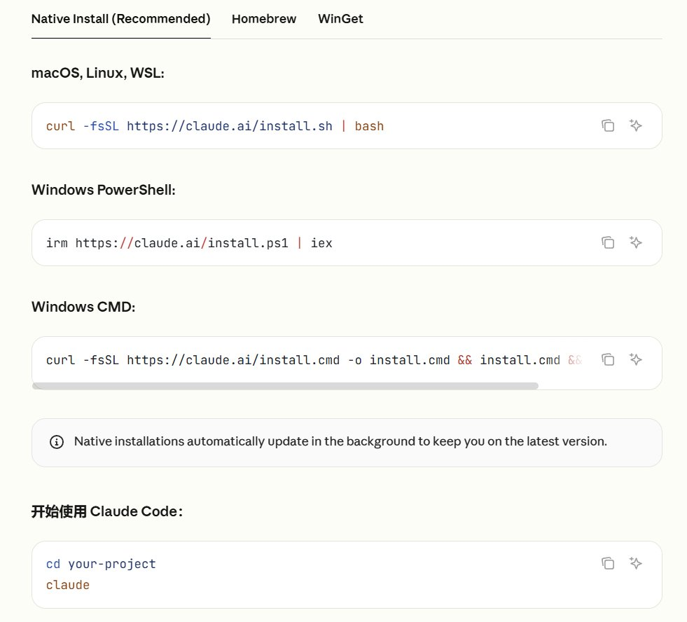
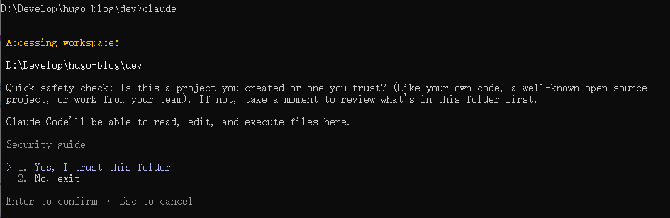
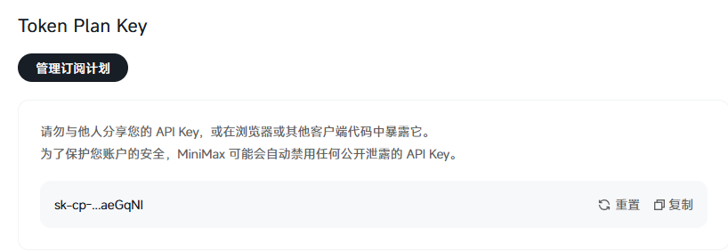
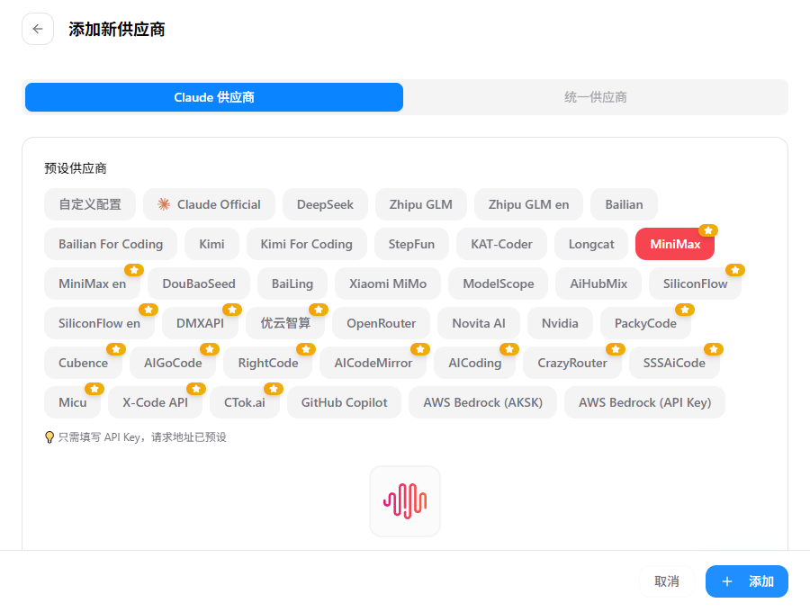
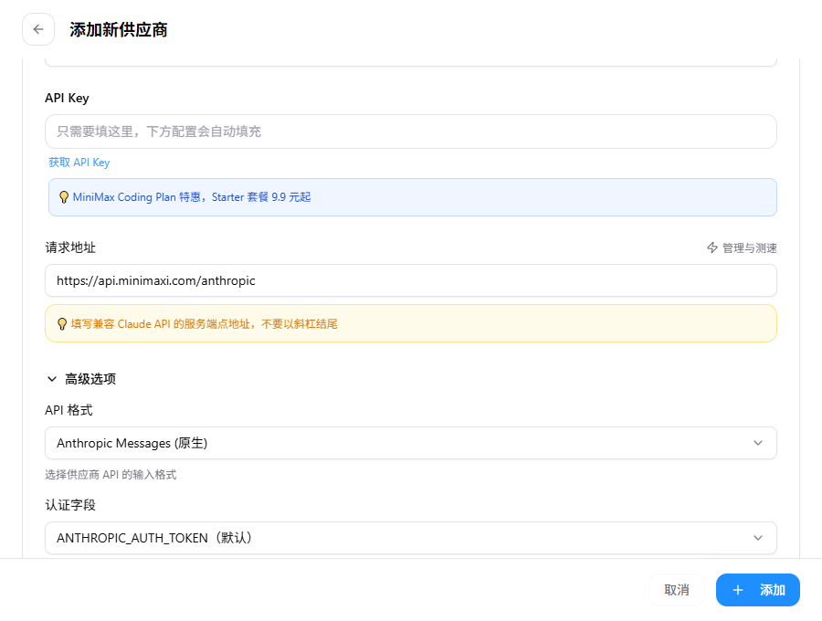
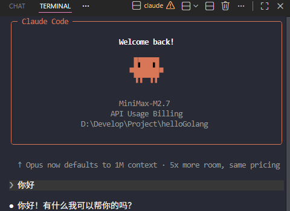
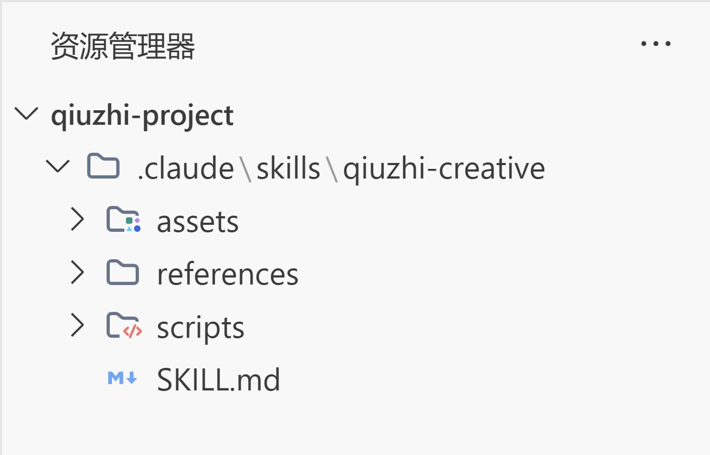

+++
title = '【学习】Agent-Skill'
description = '学习部署Agent Skill相关的技能'
date = '2026-04-06T20:59:23+08:00'
draft = false
image = 'skill.jpg'
categories = ['学习', 'Agent']
tags = ['agent', 'skill']

+++

## 【前置】安装Claude Code（Windows）

### 步骤一、官方提供了几种下载的方式，这里选择windows的powershell



管理员运行Powershell，输入下面指令

```shell
irm https://claude.ai/install.ps1 | iex
```

安装完成以后（安装过程可能需要开梯子，我是开梯子安装的）会看到下面的指令：

```shell
PS C:\Windows\system32> irm https://claude.ai/install.ps1 | iex
Setting up Claude Code...

√ Claude Code successfully installed!

  Version: 2.1.92

  Location: C:\Users\Lzh\.local\bin\claude.exe

Next: Run claude --help to get started

‼ Setup notes:
  • Native installation exists but C:\Users\Lzh\.local\bin is not in your PATH. Add it by opening: System Properties →
  Environment Variables → Edit User PATH → New → Add the path above. Then restart your terminal.

✅ Installation complete!
```

这里提示了`but C:\Users\Lzh\.local\bin is not in your PATH.`，显示环境变量没加，根据后面的提示添加环境变量

如果 Windows 安装后若提示找不到 `claude` 命令，通常是环境变量问题

### 步骤二、测试`claude`命令

随便打开一个终端，输入 `claude` 命令测试一下安装效果，如果是这样子的就说明安装成功了



然后先选择2退出，因为各种原因，国内无法使用claude原生的模型，因此我们选择minimax的供应商，minimax原生支持anthropic协议，对claude支持会比较好。

### 步骤三、申请 Minimax 的API Key

来到minimax的开发者平台 https://platform.minimaxi.com/docs/api-reference/api-overview

订阅并获取一个token plan的key



### 步骤四、下载CC-switch

CC-Switch 是一个用于切换 Claude Code 供应商（如官方、GLM、DeepSeek）的工具。https://github.com/farion1231/cc-switch/releases

安装完后配置：

1. **必须**先添加一个官方供应商（即使没账号），否则可能出错。
2. 添加第三方供应商（如Minimax），输入 API Key。
3. 点击「启用」你想要的供应商。





### 步骤五、测试

添加并启用供应商以后，来到vscode随便打开一个工作文件夹，创建一个新的终端，输入 `claude`



显示模型为MiniMax-M2.7，并且可以成功调用，说明已经配置好了

---

## 什么是Skill？

一句话总结：Skill就是**封装好的标准化工作流 / 专业知识**（Markdown + 脚本），告诉 AI **"按什么步骤、规范、逻辑"** 完成任务

一个skill的目录结构一般长这样：



```
qiuzhi-creative/
├── SKILL.md
├── scripts/
├── references/
└── assets/
```

基本上一个skill都包含这些文件：

1. **SKILL.md**：存放描述Skill的元信息，告诉agent应该怎么使用这个skill
2. **scripts**：存放执行脚本，agent一般是不会看里面的具体实现的
3. **references**：参考文档，在SKILL.md写的操作指南中，会引导ai根据不同的需求情况来参考references下的文档，所以这里面放的文档可以进一步的细分（SKILL.md教ai怎么使用skill，references的md提供具体使用案例供ai参考）
4. **assets**：也是存放参考资产的目录（可以放图片、json、html）来进一步约束skill的使用

---

## SKILL.md 详解

SKILL.md 是 Skill 的核心入口文件，agent 会读取这个文件来理解如何使用这个技能。

### 基本结构

```markdown
---
name: skill-name
description: 一句话描述这个技能的作用
---

# Skill Title

详细描述这个技能的功能和使用场景。

## When to Use
描述什么时候应该使用这个技能。

## How to Use
详细的使用说明和步骤。
```

### 关键字段

- **name**：Skill 的名称，使用 kebab-case 命名
- **description**：简短描述，用于 agent 判断何时调用此技能
- **When to Use**：触发条件，告诉 agent 在什么情况下使用
- **How to Use**：具体使用方法

### 编写技巧

1. **description 要具体**：让 agent 能准确判断是否需要调用
2. **When to Use 要清晰**：列出具体的触发场景
3. **How to Use 要详细**：包含命令、参数、示例

---

## 创建自己的 Skill

### 需求分析

在创建之前，先问自己：
- 这个 Skill 解决什么问题？
- 什么时候应该调用它？
- 需要哪些输入和输出？

### 目录结构

```
my-skill/
├── SKILL.md              # 核心文件
├── scripts/
│   └── run.sh           # 执行脚本
├── references/
│   └── guide.md         # 参考文档
└── assets/
    └── template.json    # 资源文件
```

### 编写 SKILL.md

```markdown
---
name: my-skill
description: 解决某个特定任务的技能
---

# My Skill

## Overview
简要描述这个技能的功能。

## When to Use
- 用户要求完成某某任务时
- 遇到某个特定问题时

## How to Use
1. 第一步操作
2. 第二步操作
3. 第三步操作

## Parameters
- param1: 参数说明
- param2: 参数说明
```

### 部署 Skill

将完整的 Skill 目录放入 Claude Code 的 skills 目录：
- Windows: `C:\Users\<用户名>\.claude\skills\`
- macOS/Linux: `~/.claude/skills/`

放入后重启 Claude Code 即可使用。

---

## 常用 Skill 推荐

1. **paper-2-web**：将论文转换为网站/海报/视频
2. **simplify**：代码优化和重构
3. **planning-with-files**：基于文件的复杂任务规划
4. **docx**：Word 文档处理
5. **xlsx**：Excel 表格处理
6. **pdf**：PDF 文档处理

---

## 参考资源

- [Claude Code 官方文档](https://docs.claude.ai)
- [Skill 开发指南](https://github.com/anthropics/claude-code)
