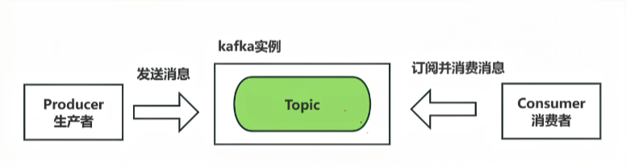
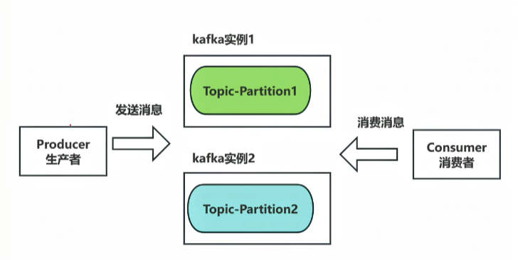
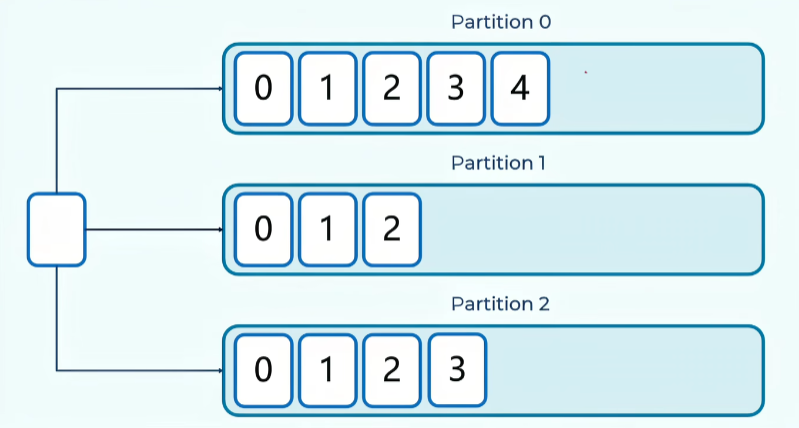
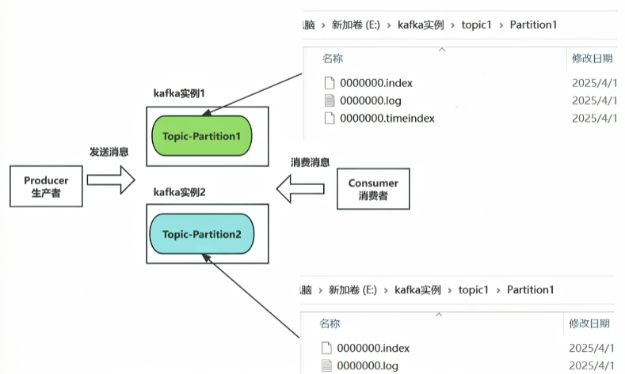
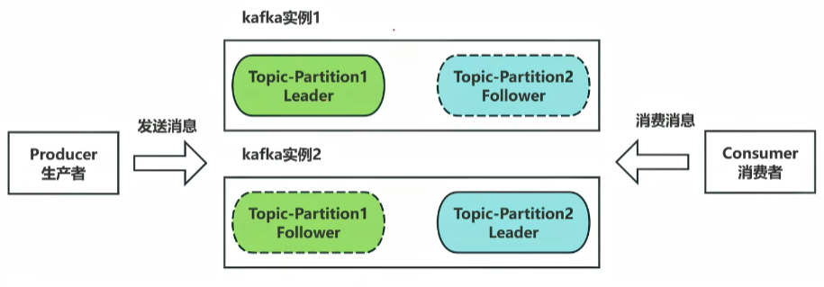
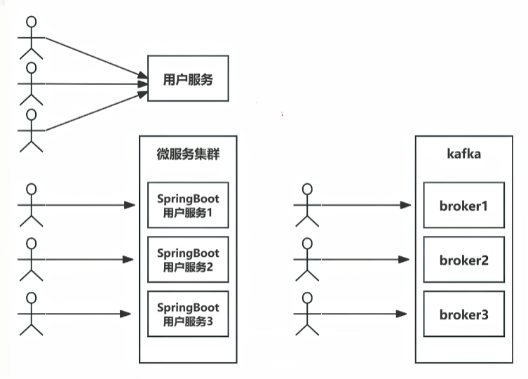
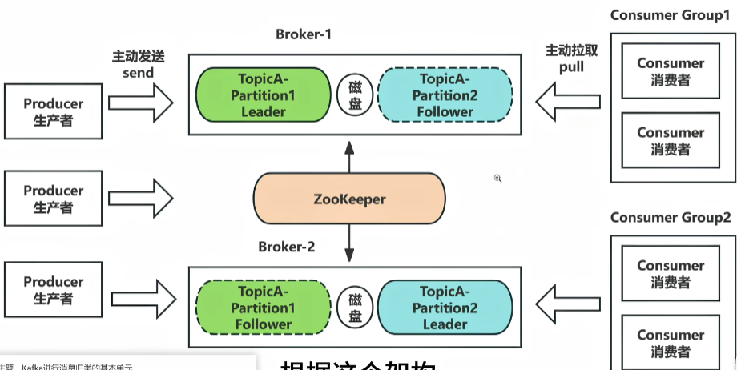
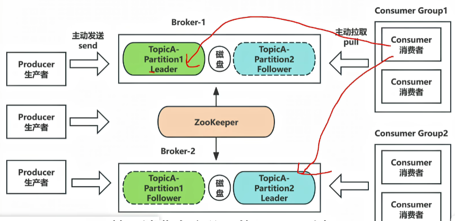
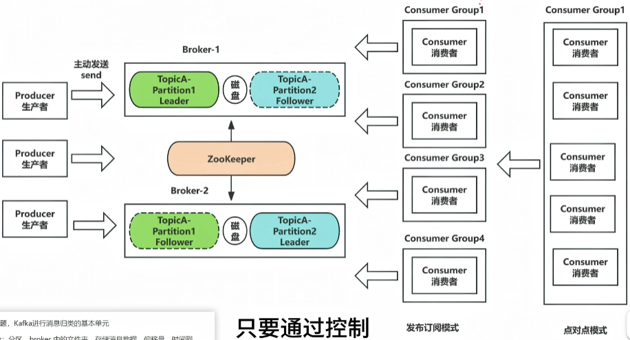

+++
title = '【技术学习】Kafka消息队列'
description = ''
date = '2026-03-09T16:16:18+08:00'
draft = true
image = 'Kafka.png'
categories = ['学习']
tags = ['Kafka']

+++
---

## Kafka基本概念

topic：主题，消息归类的基本单元

partitions：消息分区，通过偏移量offset来指定消息的位置，是实现消息的分布式管理的核心机制

replicas：分区副本，每个分区可以有多个副本，一个leader（读写）多个follower（拷贝）

broker集群：Kafka由一个或多个broker组成集群，每一个broker都是一个Kafka实例

zookeeper：协调多个broker，存储元数据

### 1. 主题（topic）和分区（partitions）

在Kafka中要实现消息的发送与订阅，必须首先创建topic

因为topic是Kafka进行消息归类的基本单元。topic接收生产者发布的消息，并将消息转发给消费者

比如任务类的消息，就指定好任务类的topic，生产者根据topic吧消息发送到队列，消费者订阅这个topic消费消息

一个topic会分成多个分区，Kafka的分区特性是实现消息的分布式管理的核心机制。消息发送到topic的时候，实际上是发送给了topic中的某一个分区，并且被添加到分区的最后，通过一个偏移量offset来指定消息的位置

分区机制是的一个topic的消息可以并行地存储和处理，从而提高了吞吐量

**默认情况下，如果Key为null，会轮询分散到不同分区；如果指定了Key，则根据Key哈希到特定分区；如果强制指定了分区，则永远只发往该分区。**

实际上每一个topic分区，都是Kafka实例中的一个文件夹：

- log：存储实际生产者发送的消息
- index：偏移量。消息的位置
- timeindex：时间戳

生产者给这个partition分区发送一条消息，就会在这三个文件中追加三条记录

> 小结：一个topic中的一个partition分区，就是存放一个消息数据的文件夹

### 2. 副本（replicas）

如果一个partition所在的Kafka实例挂了怎么办？是不是意味着这个分区上的消息都无法消费了？为了避免这种情况，定义了副本

副本是分区的另一种表现方式，实际消息的读写交互都在副本上。

副本分为leader和follower，每个分区有一个leader和多个follower，一个分区的不同副本分别放在不同的Kafka实例中，这样做的目的是为了避免Kafka实例挂掉而导致整个分区消息无法消费（分散实例宕机带来的损耗）

leader负责读写，follower只负责同步（主动从leader拉取消息，保持和leader数据一致）

> 为什么这样设计？
>
> - **保证一致性**：如果客户端同时读写不同副本，可能会读到旧数据（因为Follower可能还没同步完）。
> - **简化实现**：所有读写都在Leader，Follower只负责备份，不用处理复杂的并发一致性协议。

### 3. 集群（Broker）

broker消息代理：是Kafka的核心组件，也是Kafka实例，负责消息存储、主题和分区的管理

可以把Kafka和broker的关系理解成微服务集群和springboot的关系，某个很大访问量的服务，为了实现高可用，例如用户服务，就可以部署多个springboot框架的用户服务，这样就组成了一个用户的微服务集群。就像多个broker组成了Kafka集群，实现了高可用。

每个broker都是一个独立的Kafka实例，多个broker共同承担存储和处理消息的任务

生产者和消费者可以连接到集群中的任何一个broker来进行消息的生产和消费

### 4. Zookeeper

在Kafka 2.8及更早版本中，ZooKeeper主要用来协调Kafka的各个Broker（Broker注册与发现、选举分区副本leader），以及存储Kafka中的元数据（例如主题、分区、副本）即**协调中心和元数据仓库**。具体作用如下：

1. 存储Kafka的元数据
   Kafka Broker在启动过程中，会把所有元信息（Topic的信息、分区的信息等、Broker的注册信息）在ZooKeeper注册并保持相关的元数据更新

   由于ZooKeeper提供了监听机制，生产者或消费者程序会在ZooKeeper上注册相关的监昕器，一旦ZooKeeper中记录的元信息发生变化，生产者或消费者能及时感知并进行相应调整。这样就保证了在实现集群的动态扩容或缩容的过程中，各个Broker间仍能自动实现负载均衡，并能感知集群的变化。同时，ZooKeeper利用监听的机制监听Broker和Leader副本的存活性

2. 管理 Broker
   在KafkaBroker启动成功后，会向Zookeeper注册Broker的信息，从而实现在服务器正常运行下的水平拓展
   不但可以实现 Broker的负载均衡，而且当增加 Broker 或某个Broker故障时，ZooKeeper 会通知生产者和消费者，这样可以保证整个系统正常运转
   同时，当我们成功创建Topic后，ZooKeeper也会维护Topic与Broker之间的对应关系，这是通过/brokers/topics/topic.name节点来记录

3. 管理消费者

   消费者可以使用 Consumer Group(消费组) 的形式消费 Kafka 集群中的消息数据。 消费者在启动的过程中需要指定一个Consumer Group 的 ID， 这个 ID 会被 ZooKeeper 记录和维护。 以保证同一份数据可以被同一个 Consumer Group 的不同消费者多次消费。同时ZooKeeper管理消费者的偏移量用于跟踪当前消费者消费的位置

4. ZooKeeper对生产者的意义

   生产者在启动过程中，会向ZooKeeper中注册监听器，从而帮助生产者了解Topic中的分区信息，包括分区的增加、减少、副本的选举等。同时生产者通过动态了解运行情况实现负载均衡

   4. 1 Kafka KRaft 式
      从Kafka 2.8开始引入了KRaft模式，旨在最终取代zooKeeper，将元数据管理功能集成到Kafka Broker 内部，进一步简化部署和运维，对比ZooKeeper优势:

      1. 简化集群部署和管理-不在需要zookeeper，简化了Kafka集群的部署和管理工作，资源占用更小

      2. 提高可扩展性和弹性-单个集群中的分区数量可以扩展到数百万个。集群重启和故障恢复时间更短

      3. 更高效的元数据传播-基于日志、事件驱动的元数据传播提高了Kafka许多核心功能的性能

目前KRaft只适用于新建集群，将现有的集群从zookeeper模式迁移到KRaft模式，需要等3.5版本，Kafka4.0(2025年3月发布)将完全删除zookeeper模式，仅支持KRaft模式。

所以截止日前2025年，除了一些新项日外，Kafka在大部分项目中用的依旧是 zookeeper来作为Kafka的协调中心和元数据仓库

## 消费者组

消费者组的概念：

一个消费者可消费多个分区，就是可以消费多个分区的leader副本。

但是同一个分区只能被一个消费者消费，这样是为了提升效率

> 如果一个分区被多个消费者消费，就会出现重复消费，重复消费必然就会出现竞争、所有会需要用到锁，这样增加了性能开销

1. 发布订阅模式
   1. 只要订阅了这个topic的消费者组下的消费者，都能消费，只需要每个消费者单独命名为一个消费者组即可
2. 点对点模式
   1. 如果一个消息只需要被一个消费者消费，就可以将这些消费者放进同一个groupid

## 确认机制

- ack=0：生产者把消息扔给Kafka，**根本不关心有没有收到**，立刻认为发送成功。
  - 速度最快，安全性最低，如果网络抖动或者Kafka Broker刚好挂了，消息直接丢了，生产者完全不知道

- ack=1：生产者发送消息，**分区的Leader副本**收到消息并写入本地日志后，立即回复"成功"。
  - Follower副本此时可能还没同步。
  - 如果Leader确认后，Follower还没来得及同步，Leader突然挂了，此时Follower成为新Leader，但这条消息不在新Leader上。**这条消息就丢了！**

- ack=all或-1：生产者发送消息，Leader收到后，**等待所有ISR（同步中的副本）里的Follower都同步完这条消息**，才回复"成功"。
  - 只要ISR里至少有一个活着的副本，这条消息就**绝对不会丢**。

## 面试题

### 2. 说一下Kafka中关于事务消息的实现？

### 3. kafka的模型介绍一下，kafka是推送还是拉取？

### 4. 看过源码吗？说说Kafka处理请求的全流程？

### 5. B站评分系统为什么用Kafka？（Kafka有什么特点？）

### 6. Kafka如何保证消费顺序？

1. 只设置一个分区，这样自然所有消息都放进一个分区了，也会保证顺序消费（不建议，失去了Kafka的意义）
2. 给消息设置相同的key，相同的key的消息都会放进同一个分区，B站的评分系统就是根据选手id进行的分区，同一个选手的消息只会进入一个分区，这对于后续的时间窗口聚合逻辑至关重要