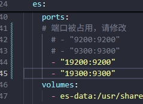
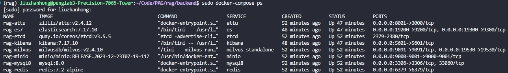

+++
title = '【RAG项目】企业级RAG项目实战'
description = '实战部署学习过程中的一些踩坑'
date = '2026-01-15T12:57:15+08:00'
draft = true
image = ''
categories = ['项目','学习']
tags = ['agent','rag']
+++

---

## 克隆代码并部署

[GitHub - KongVermouth/rag](https://github.com/KongVermouth/rag.git)

### 跟着README.MD文件到**步骤4：启动Docker容器**时卡住：

```bash
(rag) liuzhanhong@penglab3-Precision-7865-Tower:~/Code/RAG/rag/backend$ sudo docker-compose up -d
[sudo] password for liuzhanhong: 
[+] Running 8/8
 ✘ etcd Error                                                                                                                                                                                       1.1s 
 ✘ attu Error                                                                                                                                                                                       1.1s 
 ✘ minio Error                                                                                                                                                                                      1.1s 
 ✘ mysql8 Error                                                                                                                                                                                     1.1s 
 ✘ milvus-standalone Error                                                                                                                                                                          1.1s 
 ✘ es Error                                                                                                                                                                                         1.1s 
 ✘ kibana Error                                                                                                                                                                                     1.1s 
 ✘ redis Error                                                                                                                                                                                      1.1s 
Error response from daemon: Get "https://registry-1.docker.io/v2/": read tcp [2001:da8:2019:e057:bab9:94a7:cee2:35a6]:56016->[2600:1f18:2148:bc02:97a8:2125:f758:5652]:443: read: connection reset by peer
```

- **报错产生原因**：

通过修改`etc/docker/daemon.json`换源和禁用ipv6都无法解决，询问大模型得知可能是校园网将Docker Hub给墙了。

- **解决方式**：

通过本地拉取所需的镜像，再一个个复制到服务器上（p.s.下面的代码需要一条一条执行）

（1）拉取镜像：

```bash
docker pull mysql:8.0
docker pull redis:7.2-alpine
docker pull minio/minio:RELEASE.2023-12-23T07-19-11Z
docker pull quay.io/coreos/etcd:v3.5.5
docker pull milvusdb/milvus:v2.4.10
docker pull elasticsearch:7.17.10
docker pull kibana:7.17.10
docker pull zilliz/attu:v2.4.12
```

（2）导出镜像：

```bash
docker save mysql:8.0 -o mysql8.tar
docker save redis:7.2-alpine -o redis7.tar
docker save minio/minio:RELEASE.2023-12-23T07-19-11Z -o minio.tar
docker save quay.io/coreos/etcd:v3.5.5 -o etcd.tar
docker save milvusdb/milvus:v2.4.10 -o milvus.tar
docker save elasticsearch:7.17.10 -o es.tar
docker save kibana:7.17.10 -o kibana.tar
docker save zilliz/attu:v2.4.12 -o attu.tarar
```

（3）复制到penglab服务器：

```bash
scp *.tar liuzhanhong@172.22.121.98:/home/liuzhanhong/docker-images/
```

（4）在服务器中一个一个加载：

```bash
# 进到镜像目录
cd ~/docker-images

# 加载镜像（每个命令单独执行）
sudo docker load -i mysql8.tar
sudo docker load -i redis7.tar
...


# 重新执行docker-compose
sudo docker-compose up -d
```

（5）执行`docker-compose`发现es服务启动失败：原因是因为es的9200/9300端口被占用，修改`docker-compose.yaml` 文件，将es的端口改为`19200/19300`



重新执行`sudo docker-compose up -d`成功启动所有服务




### 建立数据库表

（1）使用DBeaver连接数据库，根据代码里的sql脚本创建table

（2）sql脚本有几个地方需要修改的

```sql
-- rag_knowledge 表
ALTER TABLE rag_knowledge CHANGE `document count` document_count INT DEFAULT 0;

-- rag_robot 表
ALTER TABLE rag_robot CHANGE llm_id chat_llm_id BIGINT NOT NULL;
ALTER TABLE rag_robot ADD COLUMN temperature FLOAT DEFAULT 0.7;
ALTER TABLE rag_robot ADD COLUMN max_tokens INT DEFAULT 2000;
ALTER TABLE rag_robot ADD COLUMN description VARCHAR(500);


```

因为后续在跑通流程的过程中发现前端传参和数据库表不一致，数据库缺失字段

### models/*.py实体类缺失

源码中没有提供models的所有实体类，需要自己根据数据库表自行创建

模型文件全部改为SQLAIchemy ORM模型

1. user.py

```python
"""
User SQLAlchemy模型
"""

from datetime import datetime
from typing import Optional
from sqlalchemy import Column, Integer, String, DateTime, String
from app.db.session import Base


class User(Base):
    """用户模型"""
    __tablename__ = "rag_user"
    __table_args__ = {"comment": "用户表"}

    id = Column(Integer, primary_key=True, autoincrement=True, comment="用户ID")
    username = Column(String(50), nullable=False, unique=True, comment="用户名")
    email = Column(String(100), nullable=False, unique=True, comment="邮箱")
    password_hash = Column(String(255), nullable=False, comment="密码哈希")
    password_changed_at = Column(DateTime, nullable=True, comment="密码最后修改时间")
    avatar_url = Column(String(255), nullable=True, comment="头像地址")
    role = Column(String(20), default="user", comment="角色: admin, user")
    status = Column(Integer, default=1, comment="状态: 0=禁用, 1=正常")
    created_at = Column(DateTime, default=datetime.now, comment="创建时间")
    updated_at = Column(DateTime, default=datetime.now, onupdate=datetime.now, comment="更新时间")

    def __repr__(self):
        return f"<User(id={self.id}, username='{self.username}', email='{self.email}')>"

    def is_active(self) -> bool:
        """检查用户是否激活"""
        return self.status == 1

    def is_admin(self) -> bool:
        """检查是否为管理员"""
        return self.role == "admin"
```


2. llm.py

```python
"""
LLM 大模型 SQLAlchemy模型
"""

from datetime import datetime
from typing import Optional
from sqlalchemy import Column, Integer, String, DateTime, Text
from app.db.session import Base


class LLM(Base):
    """大模型定义模型"""
    __tablename__ = "rag_llm"
    __table_args__ = {"comment": "大模型定义表"}

    id = Column(Integer, primary_key=True, autoincrement=True, comment="模型ID")
    user_id = Column(Integer, nullable=False, comment="创建者用户ID")
    name = Column(String(100), nullable=False, comment="模型显示名称")
    provider = Column(String(50), nullable=False, comment="提供商: openai, azure, anthropic, qwen")
    model_name = Column(String(100), nullable=False, comment="模型名称")
    base_url = Column(String(255), nullable=True, comment="API Endpoint")
    api_version = Column(String(50), nullable=True, comment="API版本")
    model_type = Column(String(20), nullable=False, comment="类型: chat, embedding, rerank")
    max_tokens = Column(Integer, default=4096, comment="最大上下文Token数")
    description = Column(String(255), nullable=True, comment="模型描述")
    status = Column(Integer, default=1, comment="状态：0-禁用，1-启用")
    created_at = Column(DateTime, default=datetime.now, comment="创建时间")
    updated_at = Column(DateTime, default=datetime.now, onupdate=datetime.now, comment="更新时间")

    def __repr__(self):
        return f"<LLM(id={self.id}, name='{self.name}', provider='{self.provider}')>"

    def is_chat_model(self) -> bool:
        return self.model_type == "chat"

    def is_embedding_model(self) -> bool:
        return self.model_type == "embedding"

    def is_rerank_model(self) -> bool:
        return self.model_type == "rerank"

    def is_active(self) -> bool:
        return self.status == 1

```


3. apikey.py

```python
"""
APIKey SQLAlchemy模型
"""

from datetime import datetime
from typing import Optional
from sqlalchemy import Column, Integer, String, DateTime, Text
from app.db.session import Base


class APIKey(Base):
    """模型API Key管理模型"""
    __tablename__ = "rag_apikey"
    __table_args__ = {"comment": "模型API Key管理表"}

    id = Column(Integer, primary_key=True, autoincrement=True, comment="Key ID")
    user_id = Column(Integer, nullable=False, comment="创建者用户ID")
    llm_id = Column(Integer, nullable=False, comment="关联的模型ID")
    api_key_encrypted = Column(Text, nullable=False, comment="加密后的API Key")
    alias = Column(String(100), nullable=False, comment="Key别名")
    description = Column(String(500), nullable=True, comment="密钥描述")
    status = Column(Integer, default=1, comment="状态: 0=失效, 1=正常")
    created_at = Column(DateTime, default=datetime.now, comment="创建时间")
    updated_at = Column(DateTime, default=datetime.now, onupdate=datetime.now, comment="更新时间")

    def __repr__(self):
        return f"<APIKey(id={self.id}, alias='{self.alias}', llm_id={self.llm_id})>"

    def is_active(self) -> bool:
        return self.status == 1

```


4. knowledge.py

```python
"""
Knowledge SQLAlchemy模型
"""

from datetime import datetime
from typing import Optional
from sqlalchemy import Column, Integer, String, DateTime, Text
from app.db.session import Base


class Knowledge(Base):
    """知识库模型"""
    __tablename__ = "rag_knowledge"
    __table_args__ = {"comment": "知识库表"}

    id = Column(Integer, primary_key=True, autoincrement=True, comment="知识库ID")
    user_id = Column(Integer, nullable=False, comment="所属用户ID")
    name = Column(String(100), nullable=False, comment="知识库名称")
    description = Column(String(500), nullable=True, comment="描述")
    avatar = Column(String(255), nullable=True, comment="知识库图标")
    embed_llm_id = Column(Integer, nullable=False, comment="使用的Embedding模型ID")
    vector_collection_name = Column(String(100), nullable=False, comment="向量数据库集合名称")
    chunk_size = Column(Integer, default=500, comment="切片大小")
    chunk_overlap = Column(Integer, default=50, comment="切片重叠大小")
    document_count = Column(Integer, default=0, comment="文档数量")
    total_chunks = Column(Integer, default=0, comment="总切片数")
    status = Column(Integer, default=1, comment="状态：0-禁用，1-启用")
    created_at = Column(DateTime, default=datetime.now, comment="创建时间")
    updated_at = Column(DateTime, default=datetime.now, onupdate=datetime.now, comment="更新时间")

    def __repr__(self):
        return f"<Knowledge(id={self.id}, name='{self.name}')>"

    def is_active(self) -> bool:
        return self.status == 1

```


5. document.py

```python
"""
Document SQLAlchemy模型
"""

from datetime import datetime
from typing import Optional, Dict, Any
from sqlalchemy import Column, Integer, String, DateTime, BigInteger, Text, JSON
from app.db.session import Base


class Document(Base):
    """文档模型"""
    __tablename__ = "rag_document"
    __table_args__ = {"comment": "文档表"}

    id = Column(Integer, primary_key=True, autoincrement=True, comment="文档ID")
    knowledge_id = Column(Integer, nullable=False, comment="所属知识库ID")
    file_name = Column(String(255), nullable=False, comment="原始文件名")
    file_path = Column(String(500), nullable=False, comment="文件存储路径")
    file_extension = Column(String(20), nullable=False, comment="文件后缀")
    file_size = Column(BigInteger, default=0, comment="文件大小(字节)")
    status = Column(String(20), default="uploading", comment="状态: uploading, parsing, embedding, completed, failed")
    chunk_count = Column(Integer, default=0, comment="生成的切片数量")
    error_msg = Column(Text, nullable=True, comment="失败时的错误信息")
    meta_data = Column(JSON, nullable=True, comment="文档元数据")
    created_at = Column(DateTime, default=datetime.now, comment="创建时间")
    updated_at = Column(DateTime, default=datetime.now, onupdate=datetime.now, comment="更新时间")

    def __repr__(self):
        return f"<Document(id={self.id}, file_name='{self.file_name}')>"

    def is_completed(self) -> bool:
        return self.status == "completed"

    def is_failed(self) -> bool:
        return self.status == "failed"

    def get_file_size_mb(self) -> float:
        return round(self.file_size / (1024 * 1024), 2)

```


6. robot.py

```python
"""
Robot SQLAlchemy模型
"""

from datetime import datetime
from typing import Optional, List, Dict, Any
from sqlalchemy import Column, Integer, String, DateTime, Float, Text, JSON
from app.db.session import Base


class Robot(Base):
    """问答机器人模型"""
    __tablename__ = "rag_robot"
    __table_args__ = {"comment": "问答机器人配置表"}

    id = Column(Integer, primary_key=True, autoincrement=True, comment="机器人ID")
    user_id = Column(Integer, nullable=False, comment="所属用户ID")
    name = Column(String(100), nullable=False, comment="机器人名称")
    avatar = Column(String(255), nullable=True, comment="机器人头像")
    chat_llm_id = Column(Integer, nullable=False, comment="使用的对话模型ID")
    system_prompt = Column(Text, nullable=True, comment="系统提示词")
    welcome_msg = Column(String(500), nullable=True, comment="欢迎语")
    suggested_questions = Column(JSON, nullable=True, comment="推荐问题")
    similarity_threshold = Column(Float, default=0.6, comment="相似度阈值")
    top_k = Column(Integer, default=5, comment="召回切片数量")
    temperature = Column(Float, default=0.7, comment="生成温度")
    max_tokens = Column(Integer, default=2000, comment="最大生成Token数")
    description = Column(String(500), nullable=True, comment="机器人描述")
    status = Column(Integer, default=1, comment="状态: 0=下线, 1=上线")
    created_at = Column(DateTime, default=datetime.now, comment="创建时间")
    updated_at = Column(DateTime, default=datetime.now, onupdate=datetime.now, comment="更新时间")

    def __repr__(self):
        return f"<Robot(id={self.id}, name='{self.name}')>"

    def is_active(self) -> bool:
        return self.status == 1

```


7. robot_knowledge.py

```python
"""
RobotKnowledge SQLAlchemy模型
"""

from datetime import datetime
from typing import Optional
from sqlalchemy import Column, Integer, DateTime
from app.db.session import Base


class RobotKnowledge(Base):
    """机器人-知识库关联模型"""
    __tablename__ = "rag_robot_knowledge"
    __table_args__ = {"comment": "机器人知识库关联表"}

    id = Column(Integer, primary_key=True, autoincrement=True, comment="ID")
    robot_id = Column(Integer, nullable=False, comment="机器人ID")
    knowledge_id = Column(Integer, nullable=False, comment="知识库ID")
    created_at = Column(DateTime, default=datetime.now, comment="关联时间")

    def __repr__(self):
        return f"<RobotKnowledge(id={self.id}, robot_id={self.robot_id}, knowledge_id={self.knowledge_id})>"

```


8. session.py

```python
"""
Session SQLAlchemy模型
"""

from datetime import datetime
from typing import Optional, Dict, Any
from sqlalchemy import Column, Integer, String, DateTime, JSON
from app.db.session import Base


class Session(Base):
    """用户会话模型"""
    __tablename__ = "rag_session"
    __table_args__ = {"comment": "用户会话表"}

    id = Column(Integer, primary_key=True, autoincrement=True, comment="会话ID")
    session_id = Column(String(64), nullable=False, unique=True, comment="会话UUID")
    user_id = Column(Integer, nullable=False, comment="所属用户ID")
    robot_id = Column(Integer, nullable=False, comment="关联的机器人ID")
    title = Column(String(200), nullable=True, comment="会话标题")
    summary = Column(String(500), nullable=True, comment="会话摘要")
    message_count = Column(Integer, default=0, comment="消息数量")
    status = Column(String(20), default="active", comment="状态: active, archived, deleted")
    is_pinned = Column(Integer, default=0, comment="是否置顶: 0=否, 1=是")
    last_message_at = Column(DateTime, nullable=True, comment="最后一条消息时间")
    created_at = Column(DateTime, default=datetime.now, comment="创建时间")
    updated_at = Column(DateTime, default=datetime.now, onupdate=datetime.now, comment="更新时间")
    meta_data = Column(JSON, nullable=True, comment="扩展元数据")

    def __repr__(self):
        return f"<Session(id={self.id}, session_id='{self.session_id}')>"

    def is_active(self) -> bool:
        return self.status == "active"

    def is_archived(self) -> bool:
        return self.status == "archived"

    def is_deleted(self) -> bool:
        return self.status == "deleted"

    def is_pinned(self) -> bool:
        return self.is_pinned == 1

```


9. chat_history.py

```python
"""
ChatHistory SQLAlchemy模型
"""

from datetime import datetime
from typing import Optional, List, Dict, Any
from sqlalchemy import Column, Integer, String, DateTime, Text, JSON
from app.db.session import Base


class ChatHistory(Base):
    """用户历史问答记录模型"""
    __tablename__ = "rag_chat_history"
    __table_args__ = {"comment": "用户历史问答记录表"}

    id = Column(Integer, primary_key=True, autoincrement=True, comment="记录ID")
    session_id = Column(String(64), nullable=False, comment="所属会话UUID")
    message_id = Column(String(64), nullable=False, comment="消息UUID")
    role = Column(String(20), nullable=False, comment="角色: user, assistant, system")
    content = Column(Text, nullable=False, comment="消息内容")
    retrieved_contexts = Column(JSON, nullable=True, comment="检索到的上下文")
    referenced_doc_ids = Column(JSON, nullable=True, comment="引用的文档ID列表")
    prompt_tokens = Column(Integer, default=0, comment="Prompt Token数")
    completion_tokens = Column(Integer, default=0, comment="回答 Token数")
    total_tokens = Column(Integer, default=0, comment="总Token数")
    retrieval_time_ms = Column(Integer, default=0, comment="检索耗时(毫秒)")
    generation_time_ms = Column(Integer, default=0, comment="生成耗时(毫秒)")
    total_time_ms = Column(Integer, default=0, comment="总耗时(毫秒)")
    feedback = Column(Integer, nullable=True, comment="用户反馈: 1=有用, -1=无用, NULL=未反馈")
    feedback_comment = Column(String(500), nullable=True, comment="反馈评论")
    sequence = Column(Integer, nullable=False, comment="消息序号")
    created_at = Column(DateTime, default=datetime.now, comment="创建时间")
    meta_data = Column(JSON, nullable=True, comment="扩展元数据")

    def __repr__(self):
        return f"<ChatHistory(id={self.id}, role='{self.role}', sequence={self.sequence})>"

    def is_user_message(self) -> bool:
        return self.role == "user"

    def is_assistant_message(self) -> bool:
        return self.role == "assistant"

    def is_system_message(self) -> bool:
        return self.role == "system"

    def has_feedback(self) -> bool:
        return self.feedback is not None

    def is_useful(self) -> bool:
        return self.feedback == 1

    def is_not_useful(self) -> bool:
        return self.feedback == -1

    def get_total_time_seconds(self) -> float:
        return round(self.total_time_ms / 1000, 2)

```