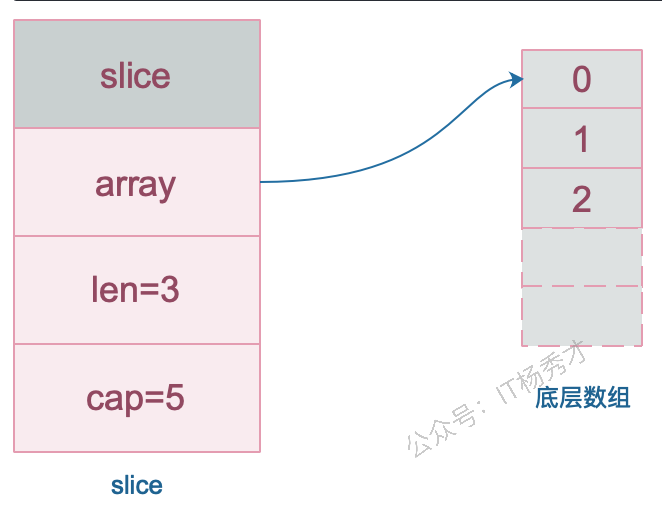
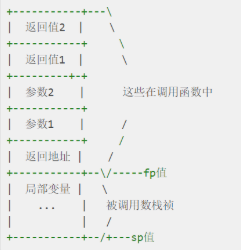
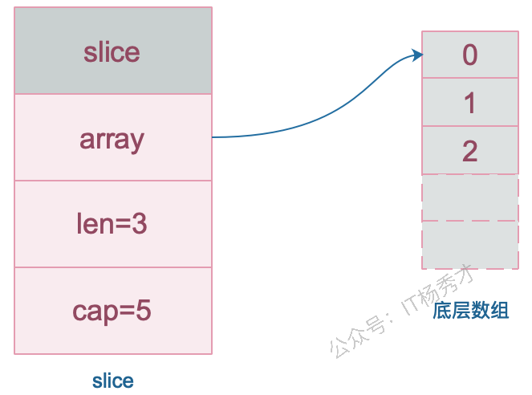
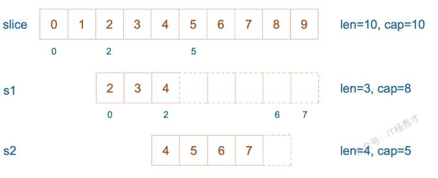
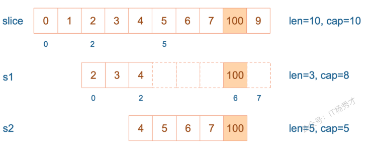
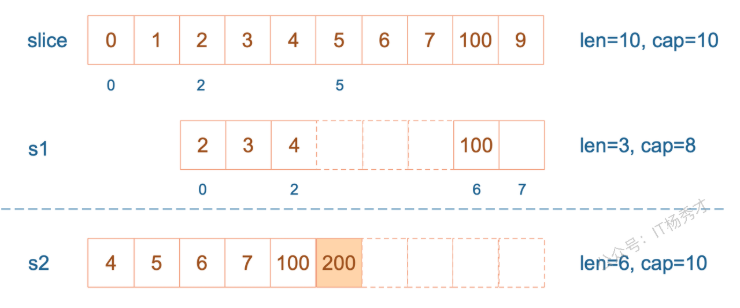
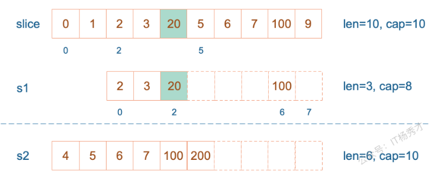
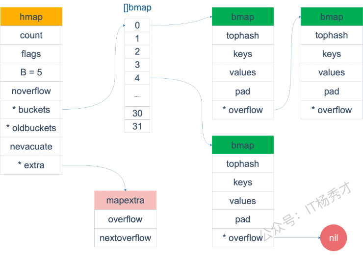
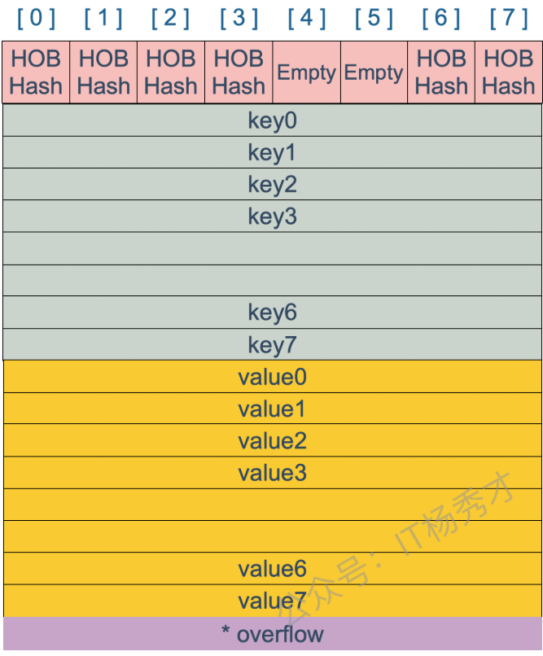

+++
title = '【学习】Golang学习与实战'
description = ''
date = '2025-03-25T10:43:29+08:00'
draft = false
image = 'PixPin_2026-03-26_15-02-34.png'
categories = ['学习', '编程']
tags = ['golang']

+++
---

## Go基础

### go有什么好处？

- 设计务实、语法简洁，开发效率高
- 针对并发做了优化，支持协程，并且实现了高效的GMP调度模型
- 高效的垃圾回收机制，支持并行垃圾回收，垃圾回收效率比java和python更高

### 什么是协程？和线程有什么区别？和进程呢？

**协程是用户态轻量级线程，是线程调度的基本单位**。通常在函数前加上go关键字就能实现并发。一个Goroutine会以一个很小的栈启动2KB或4KB，当遇到栈空间不足时，栈会自动伸缩， 因此可以轻易实现成千上万个goroutine同时启动。

**三者的区别**：

- 进程:进程是具有一定独立功能的程序，进程是系统资源分配和调度的最小单位。 每个进程都有自己的独立内存空间，不同进程通过进程间通信来通信。由于进程比较重量，占据独立的内存，所以上下文进程间的切换开销（栈、寄存器、虚拟内存、文件句柄等）比较大，但相对比较稳定安全。

- 线程:线程是进程的一个实体,线程是内核态,而且是 CPU 调度和分派的基本单位,它是比进程更小的能独立运行的基本单位。线程间通信主要通过共享内存，上下文切换很快，资源开销较少，但相比进程不够稳定容易丢失数据。

- 协程:协程是一种用户态的轻量级线程，协程的调度完全是由用户来控制的。协程拥有自己的寄存器上下文和栈。 协程调度切换时，将寄存器上下文和栈保存到其他地方，在切回来的时候，恢复先前保存的寄存器上下文和栈，直接操作栈则基本没有内核切换的开销，可以不加锁的访问全局变量，所以上下文的切换非常快。

### golang中make和new的区别？

两者都是用于内存分配的内建函数，但它们的使用场景和功能有所不同：

1. make：
   - 用于初始化并分配内存，只能用于创建`slice` `map` `channel` 三种类型
   - 返回的是初始化后的数据机构，而不是指针
2. new：
   - 用于分配内存，但不初始化，返回的是指向该内存的指针
   - 可以用于任何类型的内存分配

```go
// 使用 make 创建 slice
s := make([]int, 5) // 创建一个长度为 5 的 slice
fmt.Println(s)      // 输出: [0 0 0 0 0]

// 使用 new 创建 int 指针
p := new(int)       // 分配内存给 int 类型
fmt.Println(*p)     // 输出: 0 (初始值)
```

`make` 函数创建的是数据结构（`slice`、`map`、`channel`）本身，且返回初始化后的值。而`new` 函数创建的是可以指向任意类型的指针，返回指向未初始化零值的内存地址。

### golang中数组和切片的区别？

**数组**：

数组固定长度，长度不可改变。数组长度是数组类型的一部分，所以[3]int 和[4]int 是两种不 同的数组类型数组需要指定大小，不指定也会根据初始化，自动推算出大小， 大小不可改变。数组是通过值传递的

**切片**：

slice 的底层数据其实也是数组，slice 是对数组的封装，它描述一个数组的片段。slice 实际上是一个结构体，包含三个字段：长度、容量、底层数组。

```go
type slice struct {
        array unsafe.Pointer // 元素指针
        len   int // 长度 
        cap   int // 容量
}
```



### 使用for range的时候，它的地址会发生变化吗？

在Go1.22之前，对于 `for range` 循环中的迭代变量，其内存地址是不会发生变化的。但是，Go1.22之后的地址是临时的，是变化的，不一样的，不再是共享内存了

```go
for index, value := range collection {
    // ...
}
```

在Go1.22之前：这里 `value` 是一个**副本**。在每次迭代中，`collection` 中的当前元素值会被**复制**到 `value` 这个变量中。Go 编译器通常会为 `value` 分配一块固定的内存地址，然后在每次迭代时，将当前元素的值覆盖到这块内存中。所以，当你打印 `&value` 时，你会发现它的内存地址在整个循环过程中都是保持不变的。

但是在Go1.23及以后，使用 `for range` 遍历一个集合时，**迭代变量的地址会发生变化**。这是因为 `for range` 每次迭代时都会重新生成迭代变量（如 `value`），这些变量在内存中是不同的地址

### defer 的执行顺序是怎样的？defer 的作用或者使用场景是什么?

defer执行顺序和调用顺序相反，类似于栈后进先出(LIFO)

defer 的作用是：当 defer 语句被执行时，跟在 defer 后面的函数会被延迟执行。直到 包含该 defer 语句的函数执行完毕时，defer 后的函数才会被执行，不论包含 defer 语句的函数是通过 return 正常结束，还是由于 panic 导致的异常结束。 你可以在一个函数中执行多条 defer 语句，它们的执行顺序与声明顺序相反。

defer 的常用场景:

- defer语句经常被用于处理成对的操作，如打开、关闭、连接、断开连接、 加锁、释放锁。
- 通过defer机制，不论函数逻辑多复杂，都能保证在任何执行路径下，资源被释放。
- 释放资源的defer应该直接跟在请求资源的语句后。

### 什么是 rune 类型？

Go 语言的字符有以下两种：

- uint8 类型，或者叫 byte 型，代表了 ASCII 码的一个字符。
- rune 类型，代表一个 UTF-8 字符，当需要处理中文、日文或者其他复合字符时，则需要用到 rune 类型。rune 类型等价于 int32 类型。

```go
package main
import "fmt"

func main() {
    var str = "hello 你好" //思考下 len(str) 的长度是多少？
    
    //golang中string底层是通过byte数组实现的，直接求len 实际是在按字节长度计算  
    //所以一个汉字占3个字节算了3个长度
    fmt.Println("len(str):", len(str))  // len(str): 12

    //通过rune类型处理unicode字符
    fmt.Println("rune:", len([]rune(str))) //rune: 8
}
```

### go语言的tag有什么用？

tag可以为结构体成员提供属性。常见的：

1. json序列化或反序列化时字段的名称
2. db: sqlx模块中对应的数据库字段名
3. form: gin框架中对应的前端的数据字段名
4. binding: 搭配 form 使用, 默认如果没查找到结构体中的某个字段则不报错值为空, binding为 required 代表没找到返回错误给前端

```go
type Student struct {
	Name string `json:"name"`
	Age  int    `json:"age"`
}

func main() {
	s1 := Student{"zhangsan", 18}
	byteData, _ := json.Marshal(s1)
	fmt.Println(string(byteData))  // {"name":"zhangsan","age":18}
}
```

### go打印时%v      %+v         %#v的区别？

- %v 只输出所有的值；
- %+v 先输出字段名字，再输出该字段的值；
- %#v 先输出结构体名字值，再输出结构体（字段名字+字段的值）；

```go
package main
import "fmt"
 
type student struct {
  id   int32
  name string
}
 
func main() {
  a := &student{id: 1, name: "张三"}

  fmt.Printf("a=%v  \n", a) // a=&{1 张三}  
  fmt.Printf("a=%+v  \n", a) // a=&{id:1 name:张三}  
  fmt.Printf("a=%#v  \n", a) // a=&main.student{id:1, name:"张三"}
}
```

### init() 函数是什么时候执行的？

**简答：** 在main函数之前执行。

**详细：**init()函数是go初始化的一部分，由runtime初始化每个导入的包，初始化不是按照从上到下的导入顺序，而是按照解析的依赖关系，没有依赖的包最先初始化。

每个包首先初始化包作用域的常量和变量（常量优先于变量），然后执行包的`init()`函数。同一个包，甚至是同一个源文件可以有多个`init()`函数。`init()`函数没有入参和返回值，不能被其他函数调用，同一个包内多个`init()`函数的执行顺序不作保证。

执行顺序：import –> const –> var –>`init()`–>`main()`

一个文件可以有多个`init()`函数！

### 两个接口可以比较吗？

Go 语言中，interface 的内部实现包含了 2 个字段，类型 `T` 和 值 `V`，interface 可以使用 `==` 或 `!=` 比较。2 个 interface 相等有以下 2 种情况

1. 两个 interface 均等于 nil（此时 V 和 T 都处于 unset 状态）
2. 类型 T 相同，且对应的值 V 相等。

```go
type Stu struct {
     Name string
}

type StuInt interface{}

func main() {
     var stu1, stu2 StuInt = &Stu{"Tom"}, &Stu{"Tom"}
     var stu3, stu4 StuInt = Stu{"Tom"}, Stu{"Tom"}
     fmt.Println(stu1 == stu2) // false
     fmt.Println(stu3 == stu4) // true
}
```

`stu1` 和 `stu2` 对应的类型是 `*Stu`，值是 Stu 结构体的地址，两个地址不同，因此结果为 false。 

`stu3` 和 `stu4` 对应的类型是 `Stu`，值是 Stu 结构体，且各字段相等，因此结果为 true

### 两个nil可以不相等吗？

总结：两个nil只有在类型相同时才相等。

```go
var p *int = nil
var i interface{} = nil
if(p == i){
        fmt.Println("Equal")
}
```

### Go 语言函数传参是值类型还是引用类型？

- 在 Go 语言中只存在值传递，要么是值的副本，要么是指针的副本。无论是值类型的变量还是引用类型的变量亦或是指针类型的变量作为参数传递都会发生值拷贝，开辟新的内存空间。
- 另外值传递、引用传递和值类型、引用类型是两个不同的概念，不要混淆了。引用类型作为变量传递可以影响到函数外部是因为发生值拷贝后新旧变量指向了相同的内存地址。

### 如何知道一个对象是分配在栈上还是堆上？

Go和C++不同，Go局部变量会进行逃逸分析。如果变量离开作用域后没有被引用，则优先分配到栈上，否则分配到堆上。那么如何判断是否发生了逃逸呢？

`go build -gcflags '-m -m -l' xxx.go`.

关于逃逸的可能情况：变量大小不确定，变量类型不确定，变量分配的内存超过用户栈最大值，暴露给了外部指针。

### Go语言的多返回值是如何实现的？

Go 语言的多返回值是通过在函数调用栈帧上预留空间并进行**值复制**来实现的。在函数调用发生时，Go 编译器会计算出函数所有返回值的总大小。在为该函数创建**栈帧**时，就会在调用方（caller）的栈帧上，为这些返回值预留出连续的内存空间。

当函数执行到 `return` 语句时，它会将其要返回的各个值**复制**到这些预留好的栈空间中。函数执行完毕后，控制权返回给调用方。此时，调用方可以直接从它自己的栈帧上（即之前为返回值预留的空间）获取这些返回的值。



### Go语言中"_"的作用

1. 忽略多返回值：在 Go 语言中，函数可以返回多个值。如果你只关心其中的一部分返回值，而不需要使用其余的，就可以用 `_` 来忽略它们，从而避免编译器报错
2. 当你导入一个包时，通常会使用它的某个功能。但有时你可能只想执行包的 `init()` 函数（例如，注册驱动、初始化全局变量等），而不需要直接使用包中的任何导出成员。这时，你就可以使用 `_` 来进行**匿名导入**

示例：

```go
package main

import (
        "fmt"
        _ "net/http/pprof" // 导入 pprof 包，只为了执行其 init 函数注册 profiling 接口
)

func main() {
        fmt.Println("Application started. Profiling tools are likely registered.")
        // 实际应用中，你可能还会启动一个 HTTP 服务器来暴露 pprof 接口
        // go func() {
        //         log.Println(http.ListenAndServe("localhost:6060", nil))
        // }()
}
```

### Go语言普通指针和unsafe.Pointer有什么区别？

普通指针比如`*int`、`*string`，它们有明确的类型信息，编译器会进行类型检查和垃圾回收跟踪。不同类型的指针之间不能直接转换，这是Go类型安全的体现。

而**unsafe.Pointer**是Go的通用指针类型，可以理解为C语言中的`void*`，它绕过了Go的类型系统。unsafe.Pointer可以与任意类型的指针相互转换，也可以与uintptr进行转换来做指针运算。

另外，通指针受GC管理和类型约束，unsafe.Pointer不受类型约束但仍受GC跟踪

### unsafe.Pointer与uintptr有什么区别和联系

unsafe.Pointer和uintptr可以相互转换，这是Go提供的唯一合法的指针运算方式。典型用法是先将unsafe.Pointer转为uintptr做算术运算，然后再转回unsafe.Pointer使用。

最关键的区别在于**GC跟踪**。unsafe.Pointer会被垃圾回收器跟踪，它指向的内存不会被错误回收；而uintptr只是一个普通整数，GC完全不知道它指向什么，如果没有其他引用，对应内存可能随时被回收。

所以记住：unsafe.Pointer有GC保护，uintptr没有，这是它们最本质的区别

---

## Slice专题

### slice的底层结构是怎样的？

slice 的底层数据其实也是数组，slice 是对数组的封装，它描述一个数组的片段。slice 实际上是一个结构体，包含三个字段：长度、容量、底层数组。

```go
// runtime/slice.go
type slice struct {
        array unsafe.Pointer // 元素指针
        len   int // 长度 
        cap   int // 容量
}
```



### Go语言里slice是怎么扩容的？

1.17及以前

1. 如果期望容量大于当前容量的两倍就会使用期望容量；
2. 如果当前切片的长度小于 1024 就会将容量翻倍；
3. 如果当前切片的长度大于 1024 就会每次增加 25% 的容量，直到新容量大于期望容量；

Go1.18及以后，引入了新的扩容规则：

当原slice容量(oldcap)小于256的时候，新slice(newcap)容量为原来的2倍；原slice容量超过256，新slice容量newcap = oldcap+(oldcap+3*256)/4

### 从一个切片截取出另一个切片，修改新切片的值会影响原来的切片内容吗

在截取完之后，如果新切片没有触发扩容，则修改切片元素会影响原切片，如果触发了扩容则不会。

```go
package main

import "fmt"func main() {
        slice := []int{0, 1, 2, 3, 4, 5, 6, 7, 8, 9}
        s1 := slice[2:5]
        s2 := s1[2:6:7]

        s2 = append(s2, 100)
        s2 = append(s2, 200)

        s1[2] = 20

        fmt.Println(s1)
        fmt.Println(s2)
        fmt.Println(slice)
}
```

运行结果：

```go
[2 3 20]
[4 5 6 7 100 200]
[0 1 2 3 20 5 6 7 100 9]
```

`s1` 从 `slice` 索引2（闭区间）到索引5（开区间，元素真正取到索引4），长度为3，容量默认到数组结尾，为8。 `s2` 从 `s1` 的索引2（闭区间）到索引6（开区间，元素真正取到索引5），容量到索引7（开区间，真正到索引6），为5。



接着，向 `s2` 尾部追加一个元素 100：

```go
s2 = append(s2, 100)
```

`s2` 容量刚好够，直接追加。不过，这会修改原始数组对应位置的元素。这一改动，数组和 `s1` 都可以看得到。



再次向 `s2` 追加元素200

```go
s2 = append(s2, 200)
```

这时，`s2` 的容量不够用，该扩容了。于是，`s2` 另起炉灶，将原来的元素复制新的位置，扩大自己的容量。并且为了应对未来可能的 `append` 带来的再一次扩容，`s2` 会在此次扩容的时候多留一些 `buffer`，将新的容量将扩大为原始容量的2倍，也就是10了。



最后，修改 `s1` 索引为2位置的元素：

```go
s1[2] = 20
```

这次只会影响原始数组相应位置的元素。它影响不到 `s2` 了，人家已经远走高飞了。



再提一点，打印 `s1` 的时候，只会打印出 `s1` 长度以内的元素。所以，只会打印出3个元素，虽然它的底层数组不止3个元素

### slice作为函数参数传递，会改变原slice吗？

当 slice 作为函数参数时，因为会拷贝一份新的slice作为实参，所以原来的 slice 结构并不会被函数中的操作改变，也就是说，slice 其实是一个结构体，包含了三个成员：len, cap, array并不会变化。但是需要注意的是，尽管slice结构不会变，但是其底层数组的数据如果有修改的话，则会发生变化。若传的是 slice 的指针，则原 slice 结构会变，底层数组的数据也会变。

```go
package main

func main() {
        s := []int{1, 1, 1}
        f(s)
        fmt.Println(s)
}

func f(s []int) {
        // i只是一个副本，不能改变s中元素的值
        /*for _, i := range s {
                i++
        }
        */

        for i := range s {
                s[i] += 1
        }
}

// 输出
[2 2 2]
```

果真改变了原始 slice 的底层数据。这里传递的是一个 slice 的副本，在 `f` 函数中，`s` 只是 `main` 函数中 `s` 的一个拷贝。在`f` 函数内部，对 `s` 的作用并不会改变外层 `main` 函数的 `s`的结构。

要想真的改变外层 `slice`，只有将返回的新的 slice 赋值到原始 slice，或者向函数传递一个指向 slice 的指针。我们再来看一个例子：

```go
package main

import "fmt"

func myAppend(s []int) []int {
        // 这里 s 虽然改变了，但并不会影响外层函数的 s
        s = append(s, 100)
        return s
}

func myAppendPtr(s *[]int) {
        // 会改变外层 s 本身
        *s = append(*s, 100)
        return
}

func main() {
        s := []int{1, 1, 1}
        newS := myAppend(s)

        fmt.Println(s)
        fmt.Println(newS)

        s = newS

        myAppendPtr(&s)
        fmt.Println(s)
}

// 输出
[1 1 1]
[1 1 1 100]
[1 1 1 100 100]
```

`myAppend` 函数里，虽然改变了 `s`，但它只是一个值传递，并不会影响外层的 `s`，因此第一行打印出来的结果仍然是 `[1 1 1]`。

而 `newS` 是一个新的 `slice`，它是基于 `s` 得到的。因此它打印的是追加了一个 `100` 之后的结果： `[1 1 1 100]`。

最后，将 `newS` 赋值给了 `s`，`s` 这时才真正变成了一个新的slice。之后，再给 `myAppendPtr` 函数传入一个 `s 指针`，这回它真的被改变了：`[1 1 1 100 100]`

---


## Map

### Go语言Map的底层实现原理是怎样的？

map的就是一个hmap的结构。Go Map的底层实现是一个**哈希表**。它在运行时表现为一个指向`hmap`结构体的指针，`hmap`中记录了**桶数组指针`buckets`**、**溢出桶指针**以及**元素个数**等字段。每个桶是一个`bmap`结构体，能存储**8个键值对**和**8个`tophash`**，并有指向下一个**溢出桶的指针`overflow`**。为了**内存紧凑**，`bmap`中采用的是先存8个键再存8个值的存储方式。

分析：hmap结构定义

```go
// A header for a Go map.
type hmap struct {
   count     int // map中元素个数
   flags     uint8 // 状态标志位，标记map的一些状态
   B         uint8  // 桶数以2为底的对数，即B=log_2(len(buckets))，比如B=3，那么桶数为2^3=8
   noverflow uint16 //溢出桶数量近似值
   hash0     uint32 // 哈希种子

   buckets    unsafe.Pointer // 指向buckets数组的指针
   oldbuckets unsafe.Pointer // 是一个指向buckets数组的指针，在扩容时，oldbuckets 指向老的buckets数组(大小为新buckets数组的一半)，非扩容时，oldbuckets 为空
   nevacuate  uintptr        // 表示扩容进度的一个计数器，小于该值的桶已经完成迁移

   extra *mapextra // 指向mapextra 结构的指针，mapextra 存储map中的溢出桶
}
```



bmap结构如下：



### Go语言Map的遍历是有序的还是无序的？

Go语言里Map的遍历是**完全随机**的，并没有固定的顺序。map每次遍历,都会从一个随机值序号的桶,在每个桶中，再从按照之前选定随机槽位开始遍历,所以是无序的

### Go语言Map的遍历为什么要设计成无序的？

map 在扩容后，会发生 key 的搬迁，原来落在同一个 bucket 中的 key，搬迁后，有些 key 就要远走高飞了（bucket 序号加上了 2^B）。而遍历的过程，就是按顺序遍历 bucket，同时按顺序遍历 bucket 中的 key。搬迁后，key 的位置发生了重大的变化，有些 key 飞上高枝，有些 key 则原地不动。这样，遍历 map 的结果就不可能按原来的顺序了。

Go团队为了避免开发者写出依赖底层实现细节的脆弱代码，而**有意为之**的一个设计。通过在遍历时引入随机数，Go从根本上杜绝了程序员依赖特定遍历顺序的可能性，强制我们写出更健壮的代码。

### Map如何实现顺序读取？

如果业务上确实需要有序遍历，最规范的做法就是将Map的键（Key）取出来放入一个切片（Slice）中，用`sort`包对切片进行排序，然后根据这个有序的切片去遍历Map。

```go
package main

import (
   "fmt"
   "sort"
)

func main() {
   keyList := make([]int, 0)
   m := map[int]int{
      3: 200,
      4: 200,
      1: 100,
      8: 800,
      5: 500,
      2: 200,
   }
   for key := range m {
      keyList = append(keyList, key)
   }
   sort.Ints(keyList)
   for _, key := range keyList {
      fmt.Println(key, m[key])
   }
}
```

### Go语言的Map是否是并发安全的？

map 不是线程安全的。

在查找、赋值、遍历、删除的过程中都会检测写标志，一旦发现写标志置位（等于1），则直接 panic。赋值和删除函数在检测完写标志是复位之后，先将写标志位置位，才会进行之后的操作。

检测写标志：

```go
if h.flags&hashWriting == 0 {
                throw("concurrent map writes")
        }
```

设置写标志：

```go
h.flags |= hashWriting
```

