+++
title = '【Leetcode】算法刷题日常'
description = ''
date = '2026-02-01T16:12:08+08:00'
draft = true
image = '119571089.jpg'
categories = ['算法', '力扣']
tags = ['leetcode']

+++

---

## Day1

### 无重复字符的最长子串

https://leetcode.cn/problems/longest-substring-without-repeating-characters/description/

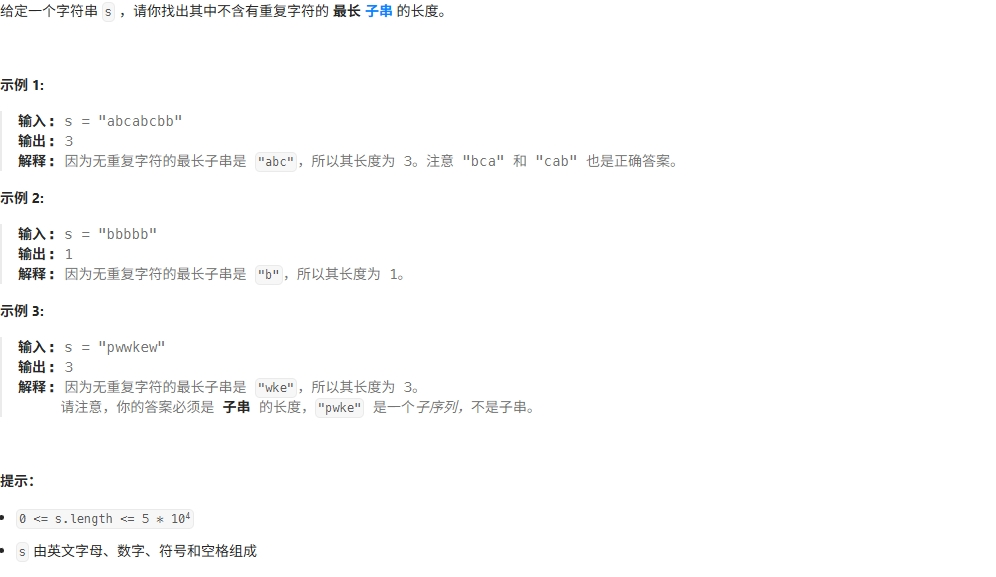

解法：滑动窗口

```java
class Solution {
    public int lengthOfLongestSubstring(String s) {
        int n = s.length();
        // 因为只有英文字母、数字、符号和空格组成
        // 所以创建一个长度为128（askii码）的数组用来记录字符出现的次数
        int[] cnt = new int[128]; 
        int ans = 0;

        int l = 0;
        char[] charS = s.toCharArray();
        // 固定左l，遍历右r
        for(int r = 0; r < n; r++) {
            char c = charS[r];
            cnt[c]++;
            // r往后遍历，窗口内有字符重复时，左边l收缩窗口
            while(cnt[c] > 1) {
                cnt[charS[l]]--;
                l++;
            }
            // 更新ans为窗口长度
            ans = Math.max(ans, r - l + 1);
        }
        return ans;
    }
}
```

---

### LRU缓存机制

https://leetcode.cn/problems/lru-cache/description/

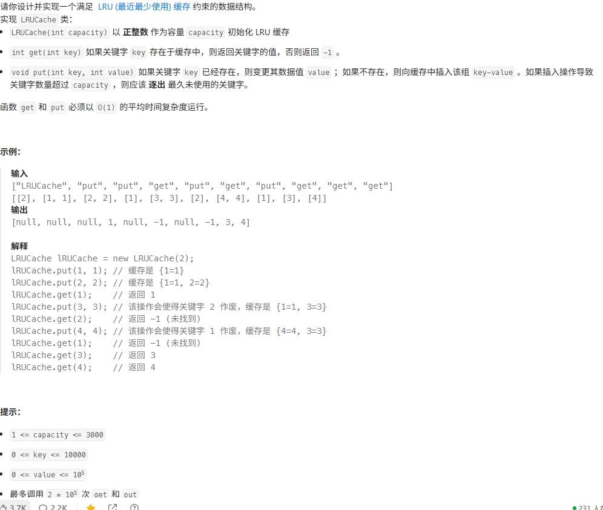

思路：使用带头尾指针的双向链表实现，使用hashMap作为缓存

1. put元素时两种情况
   
   1. put的元素不在链表中，直接链表头插（addToHead），判断容量是否超过上限，如果超过了，就移除(remove)掉最后一个节点
   
   2. put的元素在链表中，从缓存中找到该节点，移动到头部（moveToHead）

2. get获取元素
   
   1. 如果get的元素不在缓存中，返回 -1
   
   2. get的元素在缓存中，返回节点的value，同时更新缓存（moveToHead）

```java
class LRUCache {
    class Node {
        int key;
        int value;
        Node next;
        Node prev;
    }
    private final int capacity; // LRU缓存容量
    private Node head, tail; // 头尾节点
    private final Map<Integer, Node> cache = new HashMap<>(); // Map缓存

    // 初始化
    public LRUCache(int capacity) {
        this.capacity = capacity;
        head = new Node();
        tail = new Node();
        head.next = tail;
        tail.prev = head;
    }

    // put方法
    public void put (int key, int value) {
        Node node = cache.get(key);
        if (node == null) {
            Node newNode = new Node();
            newNode.key = key;
            newNode.value = value;                    
            cache.put(key, newNode);
            addToHead(newNode);
            if (cache.size() > capacity) {
                Node oldNode = popTail();
                cache.remove(oldNode);
            }
        } else {
            node.value = value;
            moveToHead(node);
        }
    }

    // get方法
    public int get(int key) {
        Node node = cache.get(key);
        if (node == null) return -1;

        moveToHead(node);
        return node.value;
    }

    // 辅助方法
    private void moveToHead(Node node) {
        remove(node);
        addToHead(node);
    }
    private void remove(Node node) {
        node.prev.next = node.next;
        node.next.prev = node.prev;
    }
    private void addToHead(Node node) {
        node.prev = head;
        node.next = head.next;
        head.next.prev = node;
        head.next = node;
    }
    private Node popTail() {
        Node res = tail.prev;
        remove(res);
        return res;
    }
}
```

---

### 反转链表easy

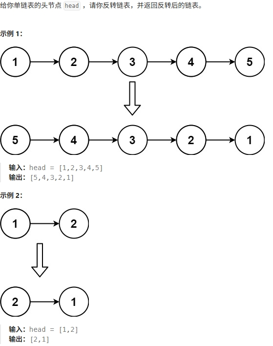

思路：原地反转，使用3个指针

```java
class Solution {
    public ListNode reverseList(ListNode head) {
        ListNode cur = head;
        ListNode pre = null;
        while (cur != null) {
            ListNode nxt = cur.next;
            cur.next = pre;
            pre = cur;
            cur = nxt;
        }
        return pre;
    }
}
```

---

### 数组中的第K个最大元素

https://leetcode.cn/problems/kth-largest-element-in-an-array/description/

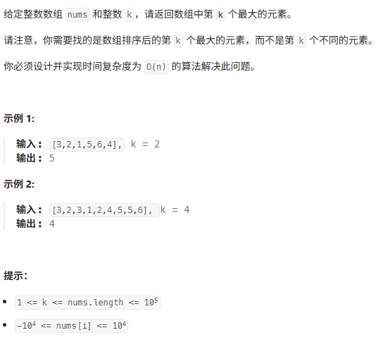

思路：

快速排序的思想，区域划分，将大于、等于、小于基准的数划分到三个数组中，之后在大于和小于的数组中递归划分，等于的直接返回

```java
class Solution {
    public int findKthLargest(int[] nums, int k) {
        List<Integer> numList = new ArrayList<>();
        for (int num : nums) {
            numList.add(num);
        }
        return quickSelect(numList, k);
    }

    public int quickSelect(List<Integer> nums, int k) {
        // 随机选择基准数
        Random rand = new Random();
        int n = nums.size();
        int randNum = rand.nextInt(n);
        int pivot = nums.get(randNum);
        // 将大于、小于、等于pivot的元素分别划分到big、small、equal中
        List<Integer> big = new ArrayList<>();
        List<Integer> small = new ArrayList<>();
        List<Integer> equal = new ArrayList<>();
        for (int num : nums) {
            if (num > pivot) {
                big.add(num);
            } else if (num < pivot) {
                small.add(num);
            } else {
                equal.add(num);
            }
        }
        // 第k大的元素在big中，递归划分
        if (k <= big.size()) {
            return quickSelect(big, k);
        }
        // 第k大的元素在small中，递归划分
        if (nums.size() - small.size() < k) {
            return quickSelect(small, k - nums.size() + small.size());
        }
        // 第k大的元素在equal中，直接返回pivot
        return pivot;
    }
}
```

解释：

- big + equal = nums.size - small；

- 如果big + equal的元素个数小于 k ，说明第k大的元素不在big和equal中，只能在small中；

- 因为big和equal中的元素都比small中的大，所以在small中需要找**第 k - (big + equeal的数量) 大的元素**

---

### k个一组反转链表hard

https://leetcode.cn/problems/reverse-nodes-in-k-group/description/

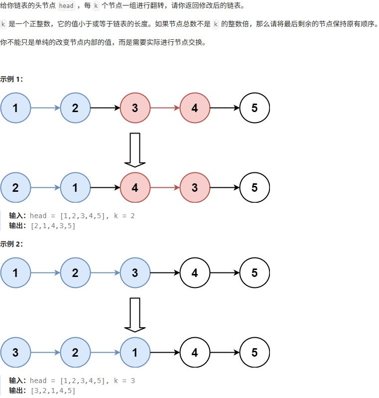

思路：

1.链表分区为已翻转部分+待翻转部分+未翻转部分

2.每次翻转前，要确定翻转链表的范围，这个必须通过k次循环来确定

3.需记录翻转链表前驱和后继，方便翻转完成后把已翻转部分和未翻转部分连接起来

4.初始需要两个变量pre和end，pre代表待翻转链表的前驱，end代表待翻转链表的末尾

5.经过k次循环，end 到达末尾，记录待翻转链表的后继next = end.next

6.翻转链表，然后将三部分链表连接起来，然后重置pre和end指针，然后进入下一次循环

7.特殊情况，当翻转部分长度不足k时，在定位end完成后，end==null，已经到达末尾，说明题目已完成，直接返回即可

8.时间复杂度为 O(n *K) 最好的情况为 O(n）最差的情况未 O(n²)

9.空间复杂度为O(1）除了几个必须的节点指针外，我们并没有占用其他空间

```java
public ListNode reverseKGroup(ListNode head, int k) {
    ListNode dummy = new ListNode(0);
    dummy.next = head;

    ListNode pre = dummy;
    ListNode end = dummy;

    while (end.next != null) {
        for (int i = 0; i < k && end != null; i++) end = end.next;
        if (end == null) break;
        ListNode start = pre.next;
        ListNode next = end.next;
        end.next = null;
        pre.next = reverse(start);
        start.next = next;
        pre = start;

        end = pre;
    }
    return dummy.next;
}

private ListNode reverse(ListNode head) {
    ListNode pre = null;
    ListNode curr = head;
    while (curr != null) {
        ListNode next = curr.next;
        curr.next = pre;
        pre = curr;
        curr = next;
    }
    return pre;
}
```

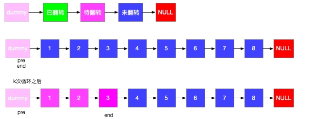

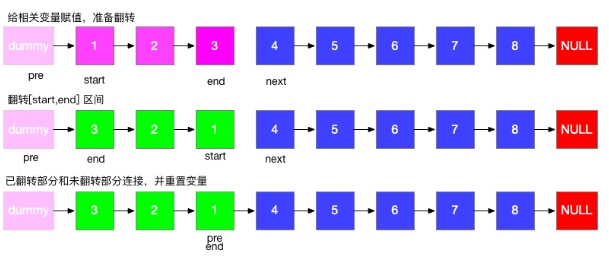

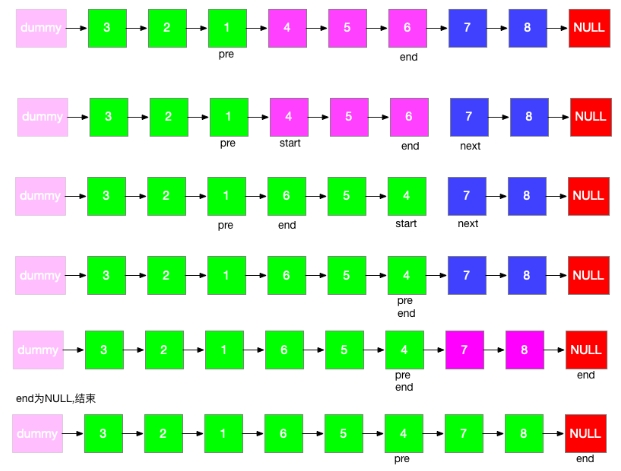

---

## Day2

### 三数之和

https://leetcode.cn/problems/3sum/description/

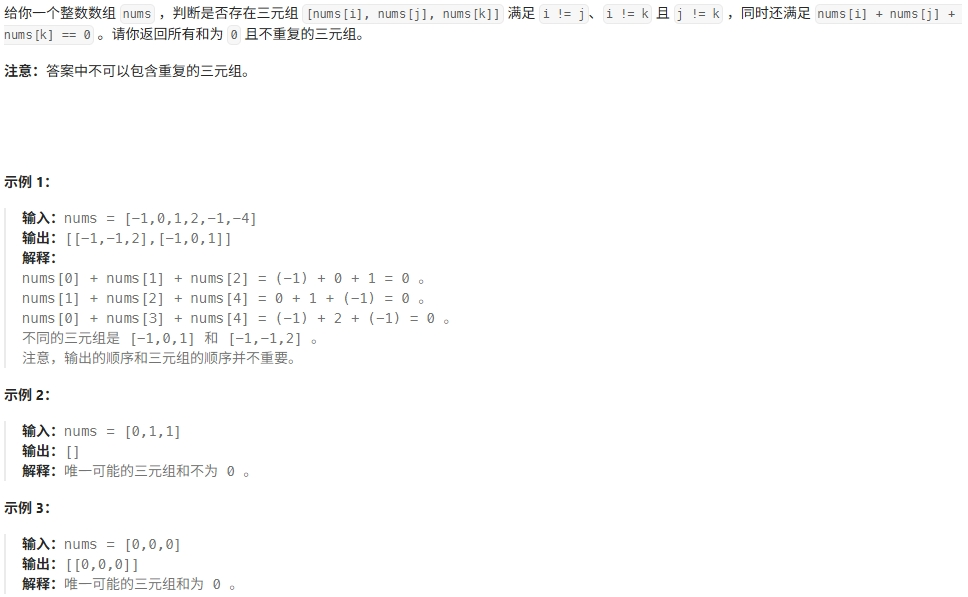

思路：

- 先排好序，最外层循环为 i 固定为左起第一个从后遍历（从小到大），内层循环双指针j、k，j为i后一个开始往后遍历（从小到大），k从最右边往左边遍历（从大到小）

- 外层去重的点：if (i > 0 && nums[i - 1] == nums[i]) continue;

- 两个外层循环的优化点：
  
  - 如果i + (i+1) + (i+2)  > 0 （最小的三个数已经大于0了）直接break掉，不进循环
  
  - 如果i + (n - 1) + (n - 2) < 0 （当前的i和最大的两个数都还小于0，说明当前的i太小） continue直接遍历下一个i

- 内层循环：
  
  - 如果i + j + k > 0了，说明k大了，k--
  
  - 如果i + j + k < 0了，说明j小了，j++
  
  - 等于0的情况下，去重 j、k ： nums[j] == nums[j - 1] ,j++;   nums[k] == nums[k + 1], k--

```java
class Solution {
    public List<List<Integer>> threeSum(int[] nums) {
        // 转化为两数之和
        List<List<Integer>> ans = new ArrayList<>();
        Arrays.sort(nums);
        int n = nums.length;
        for (int i = 0; i < n - 2; i++) {
            int x = nums[i];
            if (i > 0 && nums[i - 1] == x) continue; // 去重i

            // 2个优化
            if (x + nums[i + 1] + nums[i + 2] > 0) break;
            if (x + nums[n - 1] + nums[n - 2] < 0) continue;

            int j = i + 1;
            int k = n - 1;

            while (j < k) {
                int s = x + nums[j] + nums[k];
                if (s > 0) k--;
                else if (s < 0) j++;
                else {
                    // 去重j k
                    ans.add(List.of(x, nums[j], nums[k]));
                    for (j++;j < k && nums[j] == nums[j - 1]; j++);
                    for (k--;j < k && nums[k] == nums[k + 1]; k--);
                }
            }
        }
        return ans;
    }
}
```

---

### 相交链表

https://leetcode.cn/problems/intersection-of-two-linked-lists/description/

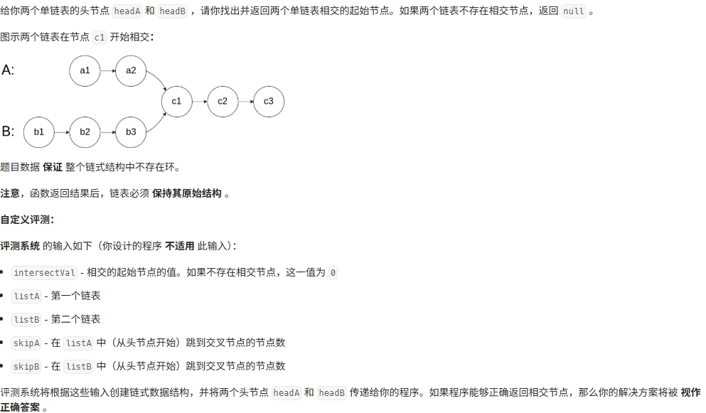

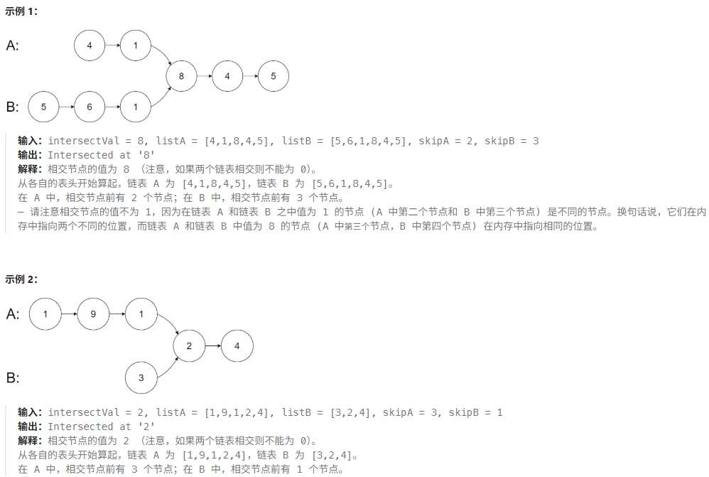

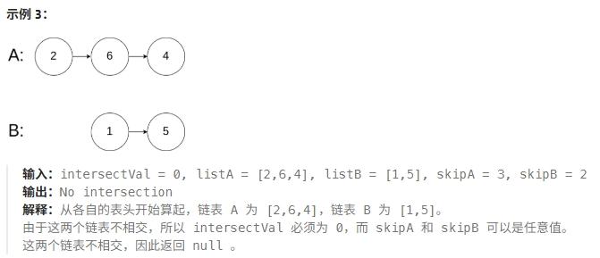

思路：独属于理科生的情话：“走过你的来时路，只为与你相遇”

设「第一个公共节点」为 node，「链表headA 」的节点数量为 a，「链表headB」的节点数量为b，「两链表的公共尾部」的节点数量为 c，则有：

- 头节点 headA 到 node 前，共有 a－c 个节点;

- 头节点 headB 到 node 前，共有 b－c 个节点;

考虑构建两个节点指针A，B分别指向两链表头节点headA，headB，做如下操作:

- 指针A 先遍历完链表headA，再开始遍历链表headB，当走到node时，共走步数为:     a+ (b - c)

- 指针B先遍历完链表headB，再开始遍历链表headA，当走到node时，共走步数为:
  b+ (a -c)
  
  如下式所示，此时指针A，B重合，并有两种情况:
  
  a + (b -c) = b+ (a - c)
  
  若两链表有公共尾部（即 c > 0）：指针A，B同时指向「第一个公共节点」node。
  
  若两链表无公共尾部（即 c = 0）：指针A，B同时指向 null。
  
  因此返回A即可。

```java
public class Solution {
    public ListNode getIntersectionNode(ListNode headA, ListNode headB) {
        if (headA == null || headB == null) {
            return null;
        }
        ListNode pA = new ListNode(-1, headA);
        ListNode pB = new ListNode(-1, headB);
        while(pA != pB) {
            pA = pA != null ? pA.next : headB;
            pB = pB != null ? pB.next : headA;
        }
        return pA;
    }
}
```

---

### 合并区间

https://leetcode.cn/problems/merge-intervals/description/

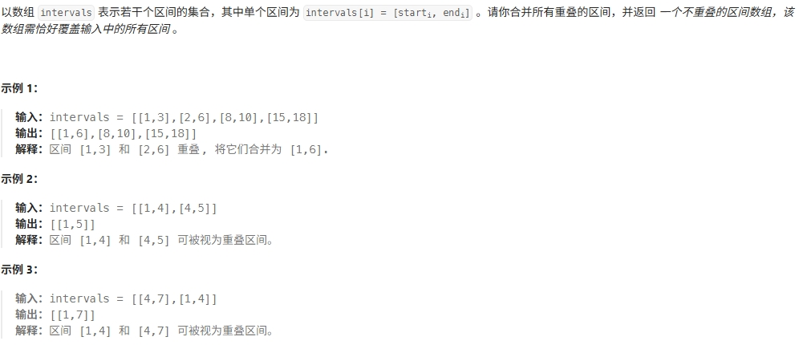

思路：

1. 先按照单个区间的第一个元素排序：`Arrays.sort(intervals, (p, q) -> p[0] - q[0])`

2. 遍历二维数组，对于每个拿到的元素（一维数组 int[ ] p）,如果当前遍历区间的左端点start_i <= 结果集合中最后一个元素的右端点end_i-1，说明是可以合并的。合并之后的右端点取当前遍历区间和结果集合最后一个元素中的大者。
   
   - `if (p[0] <= ans.get(m - 1)[1])`
   
   - `ans.get(m-1)[1] = Math.max(p[1], ans.get(m-1)[1])`

3. 不能合并的单独加入结果集合中

```java
class Solution {
    public int[][] merge(int[][] intervals) {
        Arrays.sort(intervals, (p, q) -> p[0] - q[0]); // 先按照单个区间的第一个元素排序
        List<int[]> ans = new ArrayList<>();
        for (int[] p : intervals) {
            int m = ans.size();

            // 注意边界条件 
            // 如果当前遍历区间左端点 <= 列表中最后一个元素的右端点，说明是可以合并的
            if (m > 0 && p[0] <= ans.get(m - 1)[1]) {
                // 合并之后的右端点取两者之间的大的
                ans.get(m - 1)[1] = Math.max(p[1], ans.get(m - 1)[1]);
            } else {
                ans.add(p);
            }
        }
        return ans.toArray(new int[ans.size()][]);
    }
}
```

---

### 字符串相加

https://leetcode.cn/problems/add-strings/description/

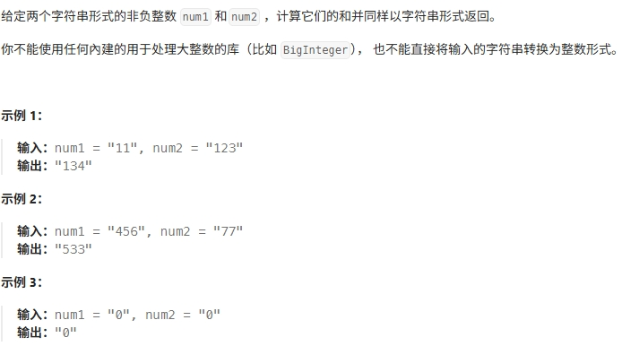

思路：

- 设定 i, j 两个指针分别指向num1和num2的尾部，模拟人工加法

- 计算进位：计算`carry = tmp / 10`，代表当前位相加是否产生进位；

- 添加当前位：计算`tmp = n1 + n2 + carry`，并将当前位`tmp % 10`添加至res头部；

- 当指针 i, j 走过数字首部后，给n1, n2赋值0，相当于给num1, num2中长度较短的数字前面填0，方便后面计算

- 当遍历完num1, num2后跳出循环，并根据carry的值决定是否在头部添加进位1，最终返回res

```java
class Solution {
    public String addStrings(String num1, String num2) {
        StringBuilder res = new StringBuilder("");
        int i = num1.length() - 1, j = num2.length() - 1, carry = 0;
        while (i >= 0 || j >= 0) {
            int n1 = i >= 0 ? num1.charAt(i) - '0' : 0;
            int n2 = j >= 0 ? num2.charAt(j) - '0' : 0;
            int tmp = n1 + n2 + carry;
            carry = tmp / 10;
            res.append(tmp % 10);
            i--;
            j--;
        }
        if (carry == 1) res.append(1);
        return res.reverse().toString();
    }
}
```

---

### 合并k个升序链表hard

https://leetcode.cn/problems/merge-k-sorted-lists/description/

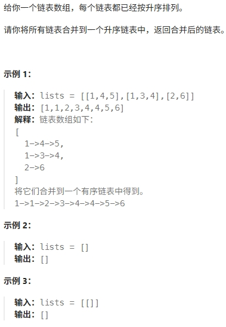

思路：分治

- 把lists一分为二，先合并前一半的链表，再合并后一半的链表

- 然后把这两个链表合并成最终的链表

- 如何合并前一半的链表？可以用递归，继续一分为二。如此下去直到只有一个链表，此时无需合并。

```java
class Solution {
    public ListNode mergeKLists(ListNode[] lists) {
        return mergeKLists(lists, 0, lists.length);
    }

    // 合并从 lists[i] 到 lists[j-1] 的链表
    private ListNode mergeKLists(ListNode[] lists, int i, int j) {
        int m = j - i;
        if (m == 0) {
            return null; // 注意输入的 lists 可能是空的
        }
        if (m == 1) {
            return lists[i]; // 无需合并，直接返回
        }
        ListNode left = mergeKLists(lists, i, i + m / 2); // 合并左半部分
        ListNode right = mergeKLists(lists, i + m / 2, j); // 合并右半部分
        return mergeTwoLists(left, right); // 最后把左半和右半合并
    }

    // 21. 合并两个有序链表
    private ListNode mergeTwoLists(ListNode list1, ListNode list2) {
        ListNode dummy = new ListNode(); // 用哨兵节点简化代码逻辑
        ListNode cur = dummy; // cur 指向新链表的末尾
        while (list1 != null && list2 != null) {
            if (list1.val < list2.val) {
                cur.next = list1; // 把 list1 加到新链表中
                list1 = list1.next;
            } else { // 注：相等的情况加哪个节点都是可以的
                cur.next = list2; // 把 list2 加到新链表中
                list2 = list2.next;
            }
            cur = cur.next;
        }
        cur.next = list1 != null ? list1 : list2; // 拼接剩余链表
        return dummy.next;
    }
}
```

---

## Day3

### 排序数组（手撕快排）

https://leetcode.cn/problems/sort-an-array/description/

```java
import java.util.Scanner;

public class Main {
    public static void main(String[] args) {
        Scanner scanner = new Scanner(System.in);
        if (scanner.hasNext()) {
            int n = scanner.nextInt();
            int[] arr = new int[n];
            for (int i = 0; i < n; i++) {
                arr[i] = scanner.nextInt();
            }

            quickSort(arr, 0, n - 1);

            StringBuilder sb = new StringBuilder();
            for (int num : arr) {
                sb.append(num).append(" ");
            }
            System.out.println(sb.toString().trim()); // 去掉首尾空格
        }
        scanner.close();
    }

    private static void quickSort(int[] arr, int left, int right) {
        if (left < right) {
            int pivotIndex = partition(arr, left, right);
            quickSort(arr, left, pivotIndex - 1);
            quickSort(arr, pivotIndex + 1, right);
        }
    }

    private static int partition(int[] arr, int left, int right) {
        int pivot = arr[left];
        int i = left, j = right;
        while (i < j) {
            while (i < j && arr[j] >= pivot) j--;
            while (i < j && arr[i] <= pivot) i++;
            if (i < j) {
                swap(arr, i, j);
            }
        }
        // 枢纽元素归位
        swap(arr, left, i);
        return i;
    }

    private static void swap(int[] arr, int i, int j) {
        int temp = arr[i];
        arr[i] = arr[j];
        arr[j] = temp;
    }
}
```

---

### 最大子数组和

https://leetcode.cn/problems/maximum-subarray/description/

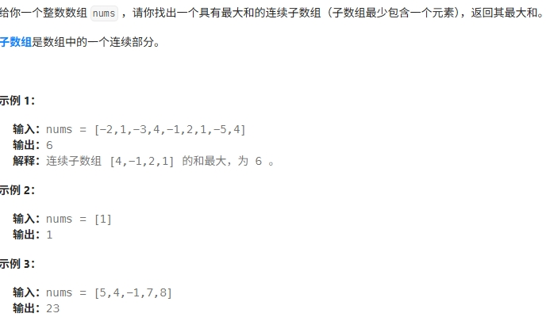

思路：

- 贪心的思想：

- 对于每一个位置，决定是 **“将当前的数加到之前的子数组中”** 还是 **“从当前的数重新开始一个新的子数组”**

- 如果以 `x` 前一个元素结尾的子数组和 `pre` 是正数（或者非负），那么加上 `x` 后，子数组变长了，和也变大了（或者没有变小），这对后续寻找最大和是有利的。**所以，我们应该“继承”之前的成果**

- 如果 `pre` 是负数，说明之前的子数组是一个“累赘”。加上它只会让总和变小。既然是负数，不如直接扔掉，从 `x` 自己开始算，**这就是“贪心”的体现——只要正收益，不要负累赘。**

```java
class Solution {
    public int maxSubArray(int[] nums) {
        int pre = 0, maxAns = nums[0];
        for (int x : nums) {
            pre = Math.max(pre + x, x);
            maxAns = Math.max(maxAns, pre);
        }
        return maxAns;
    }
}
```

---

### 最长回文子串

思路：动态规划

- 1.状态定义：dp数组

- `dp[l][r]` 的含义是：字符串 `s` 从下标 `l` 到下标 `r` 的子串（即 `s[l...r]`）是否为回文串。

- 2.状态转移方程：`if (s.charAt(l) == s.charAt(r) && (r - l <= 2 || dp[l + 1][r - 1]))`

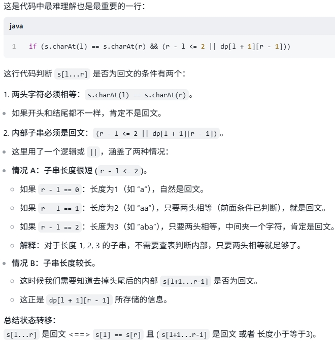

- 一旦确认 `s[l...r]` 是回文（`dp[l][r] = true`），就检查它是否比当前记录的最长回文还长。如果是，就更新起止点和长度。

```java
class Solution {
    public String longestPalindrome(String s) {
         // 用一个 boolean dp[l][r] 标识字符串从i到j这段是否为回文。
         // 如果dp[l][r] = true，要判断dp[l-1][r+1]是否为回文只需要判断l-1  r+1两个位置是否为相同字符
        if (s == null || s.length() < 2) {
            return s;
        }
        int strLen = s.length();
        int maxStart = 0; //最长回文的起点
        int maxEnd = 0; // 最长回文的终点
        int maxLen = 1; // 最长回文的长度

        boolean[][] dp = new boolean[strLen][strLen];

        for (int r = 1; r < strLen; r++) {
            for (int l = 0; l < r; l++) {
                if (s.charAt(l) == s.charAt(r) && (r - l <= 2 || dp[l + 1][r - 1])) { // r - l <= 2是为了处理长度为2和3的短回文情况
                    dp[l][r] = true;
                    if (r - l + 1 > maxLen) {
                        maxLen = r - l + 1;
                        maxStart = l;
                        maxEnd = r;
                    }
                }
            }
        }
        return s.substring(maxStart, maxEnd + 1);
    }
}
```

---

### 合并两个有序链表

https://leetcode.cn/problems/merge-two-sorted-lists/

```java
class Solution {
    public ListNode mergeTwoLists(ListNode list1, ListNode list2) {
        ListNode dummy = new ListNode();
        ListNode cur = dummy;
        while (list1 != null && list2 != null) {
            if (list1.val < list2.val) {
                cur.next = list1;
                list1 = list1.next;
            } else {
                cur.next = list2;
                list2 = list2.next;
            }
            cur = cur.next;
        }
        cur.next = list1 != null ? list1 : list2;
        return dummy.next;
    }
}
```

---

### 二叉树的层序遍历

https://leetcode.cn/problems/binary-tree-level-order-traversal/description/

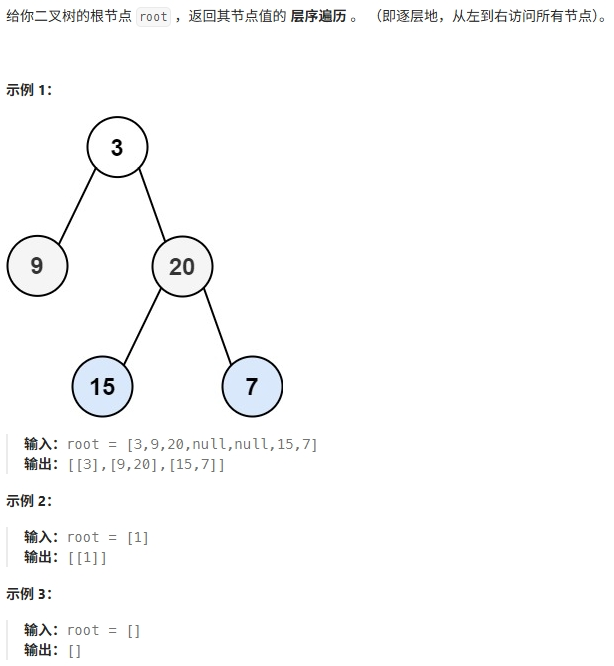

思路：模板题

- 使用队列

- 遍历该节点时，判断该节点有无左右孩子，有的话加进队列中

```java
class Solution {
    public List<List<Integer>> levelOrder(TreeNode root) {
        // 结果集合[[],[]]
        List<List<Integer>> res = new ArrayList<>();
        // 使用队列维护
        Queue<TreeNode> queue = new ArrayDeque<>();
        if (root != null) {
            queue.add(root);
        }
        while (!queue.isEmpty()) {
            int n = queue.size();
            List<Integer> level = new ArrayList<>();
            for (int i = 0; i < n; i++) {
                TreeNode node = queue.poll();
                level.add(node.val);
                if (node.left != null) {
                    queue.add(node.left);
                }
                if (node.right != null) {
                    queue.add(node.right);
                }
            }
            res.add(level);
        }
        return res;
    }
}
```

## Day4

### 搜索旋转排序数组

https://leetcode.cn/problems/search-in-rotated-sorted-array/description/

思路：

- 二分查找

- 将数组一分为二，其中一定有一个是有序的，另一个可能是有序，也能是部分有序。
  此时有序部分用二分法查找

- 无序部分再一分为二，其中一个一定有序，另一个可能有序，可能无序

- 就这样循环

```java
class Solution {
    public int search(int[] nums, int target) {
        int n = nums.length;
        if (n == 0) {
            return -1;
        }
        if (n == 1) {
            return nums[0] == target ? 0 : -1;
        }

        int l = 0, r = n - 1;
        while (l <= r) {
            int mid = (l + r) / 2;
            if (nums[mid] == target) {
                return mid;
            }
            if (nums[0] <= nums[mid]) {
                if (nums[0] <= target && target < nums[mid]) {
                    r = mid - 1;
                } else {
                    l = mid + 1;
                }
            } else {
                if (nums[mid] < target && target <= nums[n - 1]) {
                    l = mid + 1;
                } else {
                    r = mid - 1;
                }
            }
        }
        return -1;
    }
}
```

---

### 岛屿数量

https://leetcode.cn/problems/number-of-islands/description/


思路：

- dfs模版题

```java
class Solution {
    private static final int[][] DIRECTIONS = {{-1, 0}, {1, 0}, {0, -1}, {0, 1}};
    private int rows;
    private int cols;
    private char[][] grid;

    public int numIslands(char[][] grid) {
        if (grid == null || grid.length == 0) return 0;

        this.rows = grid.length;
        this.cols = grid[0].length;
        this.grid = grid;

        int res = 0;
        for (int r = 0; r < rows; r++) {
            for (int c = 0; c < cols; c++) {
                // 条件：当前节点是需要处理的目标节点（如岛屿的'1'、未访问的节点等）
                if (needProcess(r, c)) {
                    dfs(r, c); // dfs遍历相连区域
                    res++; // 遍历结束以后，res++
                }
            }
        }
        return res;
    }

    private void dfs(int r, int c) {
        // 递归终止条件1：当前节点超出网格边界，直接返回
        if (!inArea(grid, r, c)) {
            return;
        }

        // 递归终止条件2：当前节点不需要处理，直接返回
        if (!needProcess(r, c)) {
            return;
        }

        // 关键步骤：标记当前节点为已访问（避免重复遍历，根据题目自定义标记方式）
        markVisited(r, c);

        // 遍历所有方向（上下左右），递归处理相邻节点
        for (int[] dir : DIRECTIONS) {
            int newR = r + dir[0]; // 新的行号
            int newC = c + dir[1]; // 新的列号
            dfs(newR, newC);
        }
    }

    // 辅助函数：判断当前节点(r,c)是否需要处理（根据题目自定义）
    private boolean needProcess(int r, int c) {
        // 示例：岛屿数量问题中，判断是否是未访问的陆地'1'
        return grid[r][c] == '1';
    }

    // 辅助函数：判断节点是否在网格内
    private boolean inArea(char[][] grid, int r, int c) {
        return 0 <= r && r < rows && 0 <= c && c < cols;
    }

    // 辅助函数：标记节点(r,c)为已访问（根据题目自定义）
    private void markVisited(int r, int c) {
        // 示例：岛屿数量问题中，将'1'改为'2'表示已访问
        grid[r][c] = '2';
    }
}
```

---

### 两数之和

https://leetcode.cn/problems/two-sum/description/

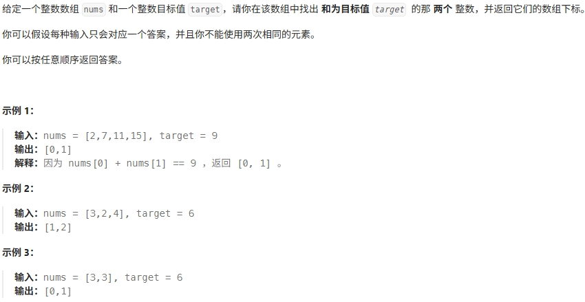

思路：

- 哈希表

- key = nums[i]

- value = i

- 遍历的时候把当前的值和对应下表放进哈希表中

- 同时判断，如果当前哈希表中存在key = target - nums[i]，说明找到了一组答案

```java
class Solution {
    public int[] twoSum(int[] nums, int target) {
        //  使用哈希表构建nums[i]  和 i 的映射
        // key = nums[i]
        // value = i
        HashMap<Integer, Integer> map = new HashMap<>();
        for (int i = 0; i < nums.length; i++) {
            if (map.containsKey(target - nums[i])) {
                return new int[]{map.get(target - nums[i]), i};
            }
            map.put(nums[i], i);
        }
        return new int[0];
    }
}
```

---

### 全排列

https://leetcode.cn/problems/permutations/description/


思路：

- 回溯

```java
class Solution {
    public List<List<Integer>> permute(int[] nums) {
        // 保存结果列表
        List<List<Integer>> ans = new ArrayList<>();
        // 存储正在构建的排列路径
        List<Integer> path = Arrays.asList(new Integer[nums.length]);
        // 标记数组：onPath[j]表示nums[j]是否已经被加入当前path中（避免重复选择）
        boolean[] onPath = new boolean[nums.length];
        dfs(0, nums, ans, path, onPath);
        return ans;
    }
    // 回溯函数：i表示当前正在填充path的第i个位置
    private void dfs(int i, int[] nums, List<List<Integer>> ans, List<Integer> path, boolean[] onPath) {
        // 递归终止条件：当i等于nums长度时，说明path已经填满，得到一个完整排列
        if (i == nums.length) {
            // 注意：需要新建一个ArrayList保存path的当前状态（因为path是复用的，后续会被修改）
            ans.add(new ArrayList<>(path));
            return;
        }
        // 遍历所有数字，尝试将未使用的数字放入当前i位置
        for (int j = 0; j < nums.length; j++) {
            // 如果nums[j]还未被加入path
            if (!onPath[j]) {
                // 选择：将nums[j]放入path的第i个位置
                path.set(i, nums[j]);
                // 标记nums[j]为已使用
                onPath[j] = true;
                // 递归：填充下一个位置（i+1）
                dfs(i + 1, nums, ans, path, onPath);
                // 回溯：撤销选择，标记nums[j]为未使用（供后续循环选择）
                onPath[j] = false;
                // 注：path的内容不需要手动撤销，因为下一次循环会用新值覆盖第i个位置
            }
        }
    }
}
```

---

### 编辑距离

https://leetcode.cn/problems/edit-distance/description/

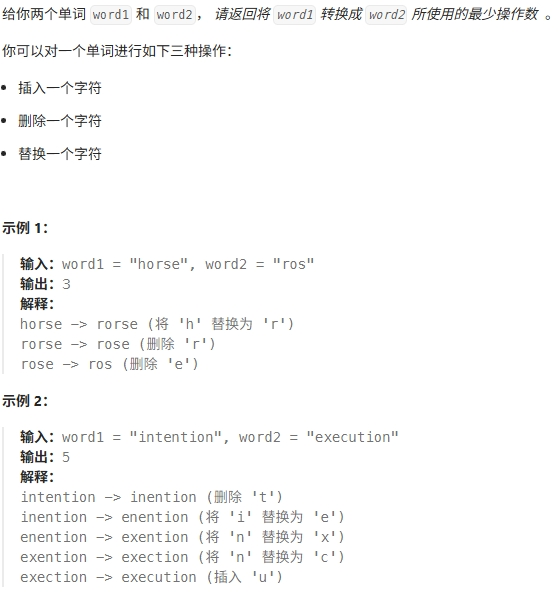

思路：

- 动态规划

- 定义dp[i][j]
  
  - dp[i][j]代表word1中前i个字符，变换到word2中前j个字符，最短需要操作的次数
  
  - 需要考虑word1或者word2一个字母都没有，即全增加/全删除的情况，所以预留dp[0][j]和dp[i][0]

- 状态转移
  
  - 增：dp[i][j] = dp[i][j - 1] + 1
  
  - 删：dp[i][j] = dp[i - 1][j] + 1
  
  - 改：dp[i][j] = dp[i - 1][j - 1] + 1

- 按顺序计算，当计算 dp[i][j]时，dp[i - 1][j]，dp[i][j - 1]，dp[i - 1][j - 1]均已确定

- 配合增删改三个操作，需要对应的dp把操作次数+1，取三种的最小

- 如果刚好这两个字母相同，那么可以直接参考dp[i - 1][j - 1]，操作不用 + 1

这道题就是**用表格记步数**，先填好边边（空变字加、字变空删），再填中间（字一样就偷懒，字不一样就从增删改里挑最少的），最后右下角的数就是答案

```java
class Solution{
    public int minDistance(String word1, String word2) {
        int m = word1.length(), n = word2.length();
        int[][] dp = new int[m + 1][n + 1];
        // 如果word2为空，那么word1变成word2只能一个个删，所以步数就是i
        for (int i = 0; i < dp.length; i++) {
            dp[i][0] = i;
        }
        // 同上，如果word1为空，要变成word2只能一个个增，所以步数就是j
        for (int j = 0; j < dp[0].length; j++) {
            dp[0][j] = j;
        }
        for (int i = 1; i < dp.length; i++) {
            for (int j = 1; j < dp[0].length; j++) {
                dp[i][j] = Math.min(dp[i - 1][j - 1], Math.min(dp[i - 1][j], dp[i][j - 1])) + 1;
                if (word1.charAt(i - 1) == word2.charAt(j - 1)) {
                    dp[i][j] = Math.min(dp[i][j], dp[i - 1][j - 1]);
                }
            }
        }
        return dp[m][n];
    }
}
```

---

## Day5

### 合并两个有序数组

https://leetcode.cn/problems/merge-sorted-array/

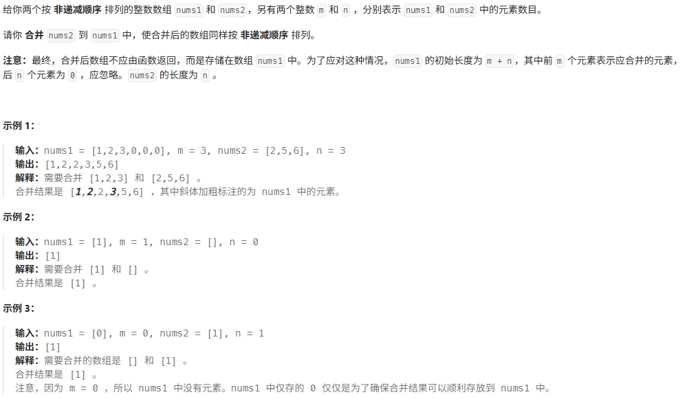

思路：

- 三指针，从后往前遍历

- p1 = m - 1, p2 = n - 1, index = m + n - 1;

- 循环终止条件是nums2元素为空`while(p2 >= 0)`

```java
class Solution {
    public void merge(int[] nums1, int m, int[] nums2, int n) {
        // 从后往前遍历，创建3个指针，p1是nums1合并前（有效数）的末尾，p2是nums2的末尾，p3是nums1的末尾
        int p1 = m - 1;
        int p2 = n - 1;
        int p = m + n - 1;

        while (p2 >= 0) {// nums2还有要合并的元素
            // 如果p1 < 0, 那么走else分支，把 nums2 合并到 nums1 中
            if (p1 >= 0 && nums1[p1] > nums2[p2]) {
                nums1[p--] = nums1[p1--]; // 填入 nums1[p1]
            } else {
                nums1[p--] = nums2[p2--];
            }
        }
    }
}
```

---

### 买卖股票的最佳时机

https://leetcode.cn/problems/best-time-to-buy-and-sell-stock/description/

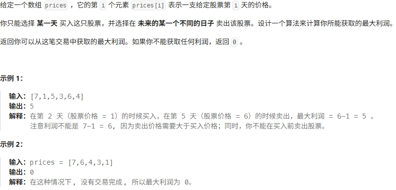

思路：

- 动态规划

- 状态转移方程：

- 如果第 i 天卖出股票，则最大利润为（该天的股价 - 前面天数中最小的股价），

- 然后与已知的最大利润比较，如果大于则更新当前最大利润的值

```java
class Solution{
    public int maxProfit(int[] prices) {
        int ans = 0;
        int value = Integer.MAX_VALUE;
        for (int price : prices) {
            value = Math.min(price, value); // 更新最小的股价
            ans = Math.max(ans, price - value); // 更新最大利润
        }
        return ans;
    }
}
```

---

### 有效的括号

https://leetcode.cn/problems/valid-parentheses/description/

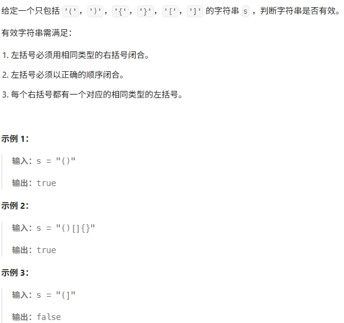

思路：

- 括号匹配问题使用数据结构--栈

- 先看长度是不是偶数，奇数直接错

- 左括号->放对应右括号进栈，top++

- 右括号->栈空/拿出来的栈顶元素≠当前元素，直接错；匹配成功就--top

- 最后看栈是否为空，为空就说明全部配对成功

```java
class Solution {
    public boolean isValid(String s) {
        int n = s.length();
        // 必须22匹配。如果长度是奇数，直接返回false
        if (n % 2 != 0) {
            return false;
        }

        // 创建一个栈，如果是左括号则入栈，
        char[] stack = s.toCharArray();
        int top = 0;
        for (char c : stack) {
            if (c == '(') {
                stack[top++] = ')'; // 入栈对应的右括号
            } else if (c == '[') {
                stack[top++] = ']';
            } else if (c == '{') {
                stack[top++] = '}';
            } else if (top == 0 || stack[--top] != c) {
                return false;
            }
        }
        return top == 0;
    }
}
```

---

### 二叉树的最近公共祖先

https://leetcode.cn/problems/lowest-common-ancestor-of-a-binary-tree/description/


思路：

- 递归

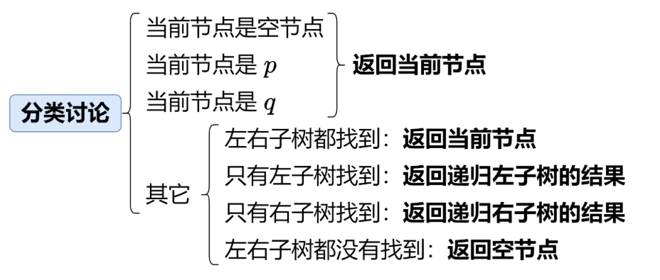

```java
class Solution {
    public TreeNode lowestCommonAncestor(TreeNode root, TreeNode p, TreeNode q) {
        // basecase：如果root是空，或者就是p或q，直接返回
        if (root == null || root == p || root == q) {
            return root;
        }
        // 在左子树中找p或者q
        TreeNode left = lowestCommonAncestor(root.left, p, q);
        // 在右子树中找p或者q
        TreeNode right = lowestCommonAncestor(root.right, p, q);

        // 情况1：如果左右都找到了->当前root就是最近公共祖先
        if (left != null && right != null) {
            return root; // 当前节点是最近公共祖先
        }
        // 情况2：
        // 如果只有左子树找到，就返回左子树的返回值
        // 如果只有右子树找到，就返回右子树的返回值
        // 如果左右子树都没有找到，就返回 null（注意此时 right = null）
        return left != null ? left : right;
    }
}
```

---

### 反转链表②

https://leetcode.cn/problems/reverse-linked-list-ii/description/

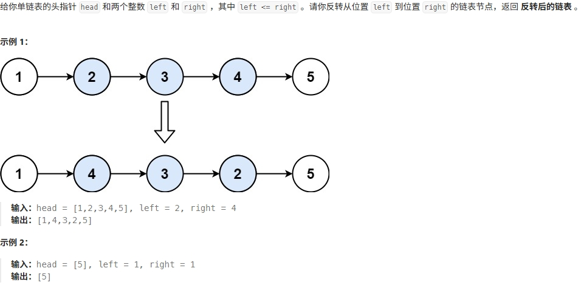

思路：

- 找到要反转的区间的前驱pre

- 使用单次的反转链表，循环right - left + 1次

- 反转完以后，pre指向的是反转链表的开头，cur指向的是right的后一个节点


```java
class Solution {
    public ListNode reverseBetween(ListNode head, int left, int right) {
        ListNode dummy = new ListNode(-1);
        dummy.next = head;
        ListNode pre = dummy;
        // 找到要反转的区间的前驱pre
        for (int i = 0; i < left - 1; i++) {
            pre = pre.next;
        }
        ListNode cur = pre.next;
        // 使用单次的反转链表，循环right - left + 1次
        for (int i = 0; i < right - left; i++) {
            ListNode next = cur.next;
            cur.next = next.next;
            next.next = pre.next;
            pre.next = next;
        }
        return dummy.next;
    }
}
```

---

## Day6

### 二叉树的锯齿形层序遍历

https://leetcode.cn/problems/binary-tree-zigzag-level-order-traversal/description/

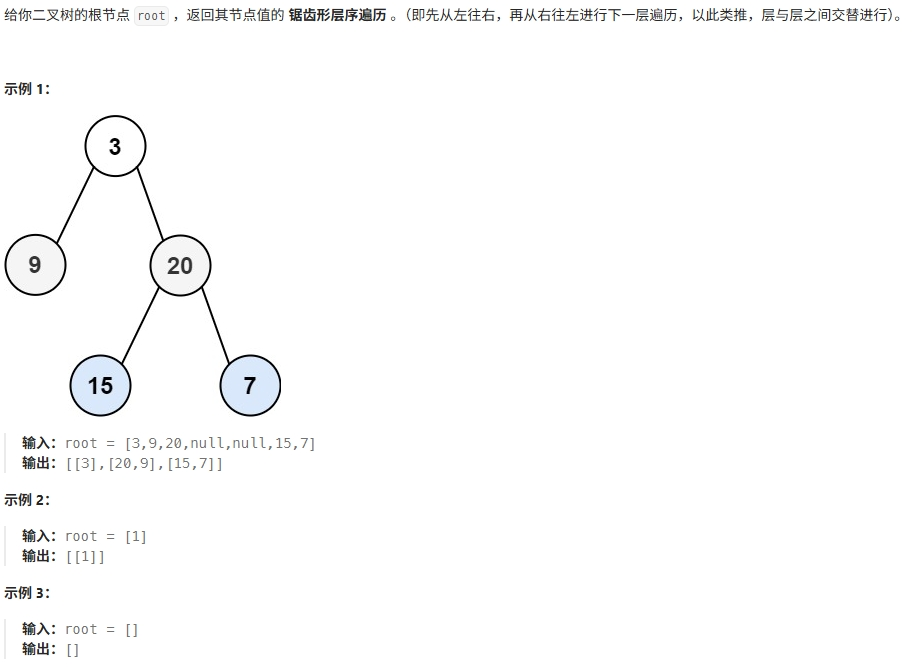

思路：

- 同二叉树的程序遍历

- 多一个步骤

- 当前层是奇数，直接添加进结果集；当前层是偶数，则将level反转一下再加入结果集

```java
class Solution{
    public List<List<Integer>> zigzagLevelOrder(TreeNode root) {
        List<List<Integer>> ans = new ArrayList<>();
        Queue<TreeNode> queue = new ArrayDeque<>();
        if (root != null) {
            queue.add(root);
        }

        while (!queue.isEmpty()) {
            int n = queue.size();
            List<Integer> level = new ArrayList<>();
            while (n-- > 0) {
                TreeNode node = queue.poll();
                level.add(node.val);
                if (node.left != null) queue.add(node.left);
                if (node.right != null) queue.add(node.right);
            }
            if (ans.size() % 2 > 0) {
                // 如果结果集已经是奇数，说明目前是在偶数层，需要反转
                Collections.reverse(level);
            } 
            ans.add(level);    
        }
        return ans;
    }
}
```

---

### 环形链表

https://leetcode.cn/problems/linked-list-cycle/description/

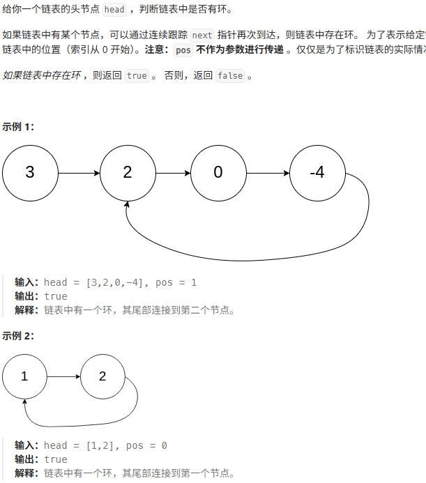

思路：

- 快慢指针

- 一个指针走一步，另一个走两步，如果相遇了说明有环

```java
public class Solution {
    public boolean hasCycle(ListNode head) {
        ListNode slow = head;
        ListNode fast = head; // 乌龟和兔子同时从起点出发
        while (fast != null && fast.next != null) {
            slow = slow.next; // 乌龟走一步
            fast = fast.next.next; // 兔子走两步
            if (fast == slow) { // 兔子追上乌龟（套圈），说明有环
                return true;
            }
        }
        return false; // 访问到了链表末尾，无环
    }
}
```

---

### 重排链表

https://leetcode.cn/problems/reorder-list/description/

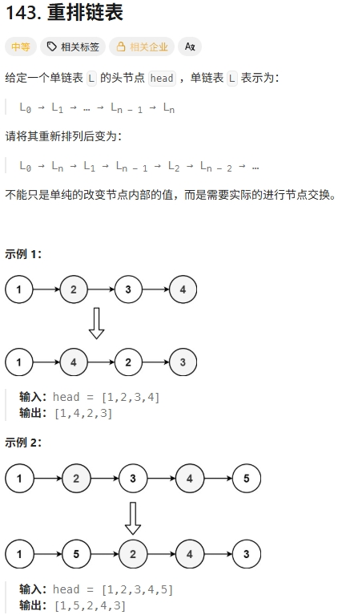

思路：

- 找到链表的中间节点，将链表分成两部分

- 反转后半部分

- 交替插入

```java
class Solution {
    public void reorderList(ListNode head) {
        ListNode mid = middleNode(head);
        ListNode head2 = reverseList(mid);
        while (head2.next != null) {
            ListNode nxt = head.next;
            ListNode nxt2 = head2.next;
            head.next = head2;
            head2.next = nxt;
            head = nxt;
            head2 = nxt2;
        }
    }
    // 876.链表的中间节点
    private ListNode middleNode(ListNode head) {
        ListNode slow = head, fast = head;
        while(fast != null && fast.next != null) {
            slow = slow.next;
            fast = fast.next.next;
        }
        return slow;
    }
    // 206.反转链表
    private ListNode reverseList(ListNode head) {
        ListNode pre = null;
        ListNode cur = head;
        while (cur != null) {
            ListNode nxt = cur.next;
            cur.next = cur;
            cur.next = pre;
            pre = cur;
            cur = nxt;
        }
        return pre;
    }
}
```

---

### 螺旋矩阵

https://leetcode.cn/problems/spiral-matrix/description/

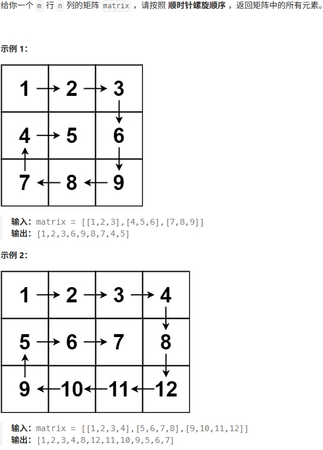

思路：

- 模拟

- 从左上开始，先走right，再走bottom，然后是left，最后是top

```java
class Solution {
    public List<Integer> spiralOrder(int[][] matrix) {
        List<Integer> ans = new ArrayList<>();
        if (matrix == null || matrix.length == 0 || matrix[0].length == 0) {
            return ans;
        }
        int rows = matrix.length, cols = matrix[0].length;
        int left = 0, right = cols - 1, top = 0, bottom = rows - 1;

        while (top <= bottom && left <= right) {
            // 右
            for (int i = left; i <= right; i++) {
                ans.add(matrix[top][i]);
            }
            top++; // 右走完了，该向下走了，top++
            if (top > bottom) break; 

            // 下
            for (int i = top; i<= bottom; i++) {
                ans.add(matrix[i][right]);
            }
            right--; // 下走完了，该往左走了，right--
            if (right < left) break;

            // 左
            for (int i = right; i >= left; i--) {
                ans.add(matrix[bottom][i]);
            }
            bottom--;
            if (bottom < top) break;

            // 上
            for (int i = bottom; i >= top; i--) {
                ans.add(matrix[i][left]);
            }
            left++;
            if (left > right) break;
        }
        return ans;
    }
}
```

---

### 最长递增子序列

https://leetcode.cn/problems/longest-increasing-subsequence/description/

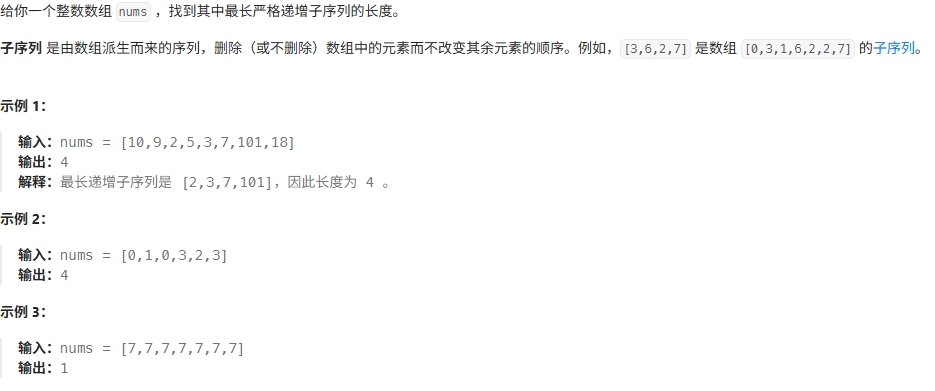

思路：

- 动态规划，记忆化搜索

```java
class Solution {
    /**
     * 计算最长递增子序列的长度
     * 动态规划解法：时间复杂度 O(n²)，空间复杂度 O(n)
     * 
     * @param nums 输入的整数数组
     * @return 最长递增子序列的长度
     */
    public int lengthOfLIS(int[] nums) {
        // 边界情况：空数组直接返回0
        if(nums.length == 0) return 0;

        // dp[i] 表示以 nums[i] 结尾的最长递增子序列的长度
        int[] dp = new int[nums.length];

        // 记录全局最大值，即最终答案
        int res = 0;

        // 初始化：每个元素自身构成长度为1的递增子序列
        Arrays.fill(dp, 1);

        // 外层循环：遍历每个位置 i，计算以 nums[i] 结尾的 LIS 长度
        for(int i = 0; i < nums.length; i++) {

            // 内层循环：遍历 i 之前的所有位置 j，寻找可以接在 nums[i] 前面的递增子序列
            for(int j = 0; j < i; j++) {

                // 如果 nums[j] < nums[i]，说明 nums[i] 可以接在以 nums[j] 结尾的子序列后面
                // 此时更新 dp[i]：选择更长的那个（保持原值 或 接在 j 后面）
                if(nums[j] < nums[i]) {
                    dp[i] = Math.max(dp[i], dp[j] + 1);
                }
            }

            // 更新全局最大值：取当前最大值 和 以 nums[i] 结尾的 LIS 长度的较大者
            res = Math.max(res, dp[i]);
        }

        return res;
    }
}
```

---

## Day7

### 删除排序链表中的重复元素

https://leetcode.cn/problems/remove-duplicates-from-sorted-list-ii/description/

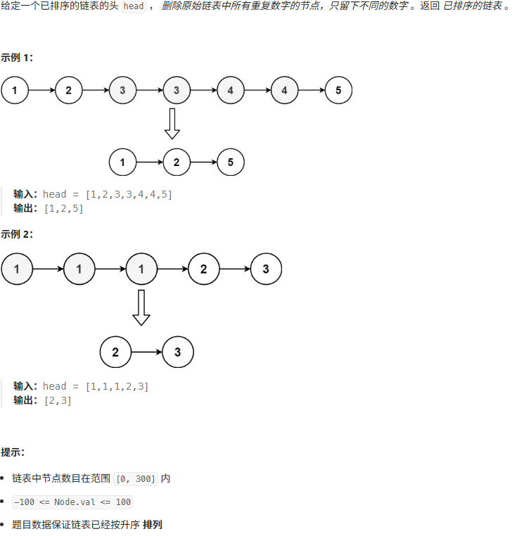

思路：

- 一次遍历
- 创建一个dummy虚拟头节点；再创建一个pre节点，用来表示需要处理的节点的前一个节点
- 当pre的后两个节点值相同，说明需要删除
- 然后循环处理，将值等于 x 的全部删除

```java
class Solution {
    public ListNode deleteDuplicates(ListNode head) {
        if (head == null) return head;

        ListNode dummy = new ListNode(0, head);

        ListNode pre = dummy;
        while (pre.next != null && pre.next.next != null) {
            if (pre.next.val == pre.next.next.val) { // 后两个节点值相同
                int x = pre.next.val;
                // 值等于 x 的节点全部删除
                while (pre.next != null && pre.next.val == x) {
                    pre.next = pre.next.next;
                } 
            } else {
                pre = pre.next;
            }
        }
        return dummy.next;
    }
}
```

---

### 接雨水

https://leetcode.cn/problems/trapping-rain-water/description/

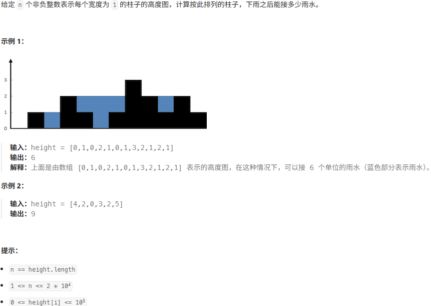

思路：

- 双指针法
- 前缀的preMax和后缀的sufMax
- 当前i位置的雨水量等于前缀max和后缀max中最小的那个 - 当前高度

``` java
class Solution {
    public int trap(int[] height) {
        int n = height.length;
        int[] preMax = new int[n];
        preMax[0] = height[0];
        for (int i = 1; i < n; i++) {
            preMax[i] = Math.max(preMax[i - 1], height[i]);
        }
        int[] sufMax = new int[n];
        sufMax[n - 1] = height[n - 1];
        for (int i = n - 2; i >= 0; i--) {
            sufMax[i] = Math.max(sufMax[i + 1], height[i]);
        } 

        int ans = 0;
        for (int i = 0; i < n; i++) {
            ans += Math.min(sufMax[i], preMax[i]) - height[i];
        }
        return ans;
    }
}
```

---

### 复原IP地址

https://leetcode.cn/problems/restore-ip-addresses/description/

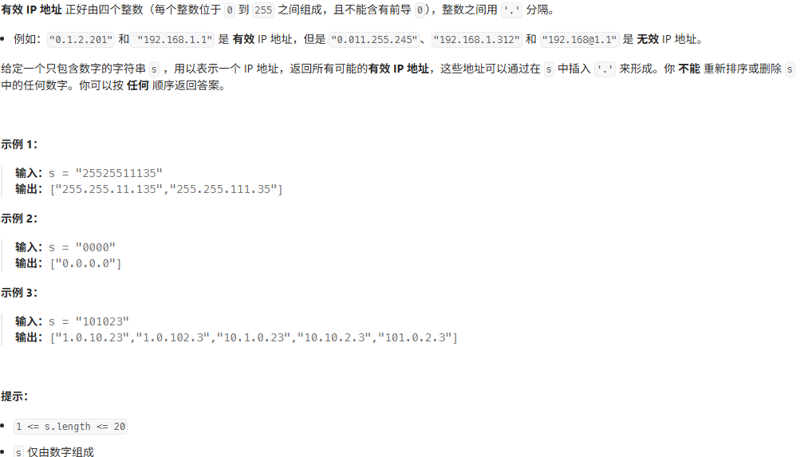

> todo

思路：

- 回溯三部曲：
- 递归参数
- 递归终止条件
- 单层搜索的逻辑

``` java
class Solution {
    public List<String> restoreIpAddresses(String s) {
        List<String> ans = new ArrayList<>();
        int[] path = new int[4]; // path[i] 表示第 i 段的结束位置 + 1（右开区间）
        dfs(0, 0, 0, s, s.length(), path, ans);
        return ans;
    }

    // 分割 s[i] 到 s[n-1]，现在在第 j 段（j 从 0 开始），数值为 ipVal
    private void dfs(int i, int j, int ipVal, String s, int n, int[] path, List<String> ans) {
        if (i == n) { // s 分割完毕
            if (j == 4) { // 必须有 4 段
                int a = path[0], b = path[1], c = path[2];
                ans.add(s.substring(0, a) + "." + s.substring(a, b) + "." + s.substring(b, c) + "." + s.substring(c));
            }
            return;
        }

        if (j == 4) { // j=4 的时候必须分割完毕，不能有剩余字符
            return;
        }

        // 手动把字符串转成整数，这样字符串转整数是严格 O(1) 的
        ipVal = ipVal * 10 + (s.charAt(i) - '0');
        if (ipVal > 255) { // 不合法
            return;
        }

        // 不分割，不以 s[i] 为这一段的结尾
        if (ipVal > 0) { // 无前导零
            dfs(i + 1, j, ipVal, s, n, path, ans);
        }

        // 分割，以 s[i] 为这一段的结尾
        path[j] = i + 1; // 记录下一段的开始位置
        dfs(i + 1, j + 1, 0, s, n, path, ans);
    }
}

```

---

### 最长公共子序列

https://leetcode.cn/problems/longest-common-subsequence/description/

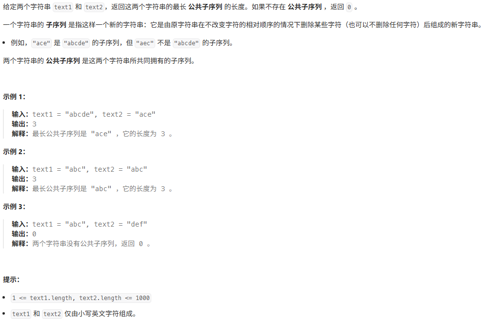

> todo

思路：

```java
class Solution {
    public int longestCommonSubsequence(String text1, String text2) {
        int m = text1.length();
        int n = text2.length();
        
        // 特殊情况：若任一字符串为空，直接返回"-1"
        if (m == 0 || n == 0) {
            return 0;
        }
        
        // 创建DP表，存储LCS长度
        int[][] dp = new int[m + 1][n + 1];
        
        // 填充DP表
        for (int i = 1; i <= m; i++) {
            for (int j = 1; j <= n; j++) {
                if (text1.charAt(i - 1) == text2.charAt(j - 1)) {
                    // 当前字符相同，LCS长度+1
                    dp[i][j] = dp[i - 1][j - 1] + 1;
                } else {
                    // 字符不同，取子问题的最大值
                    dp[i][j] = Math.max(dp[i - 1][j], dp[i][j - 1]);
                }
            }
        }
        return dp[m][n];
    }
}
```

---

### 二叉树中的最大路径和

https://leetcode.cn/problems/binary-tree-maximum-path-sum/description/

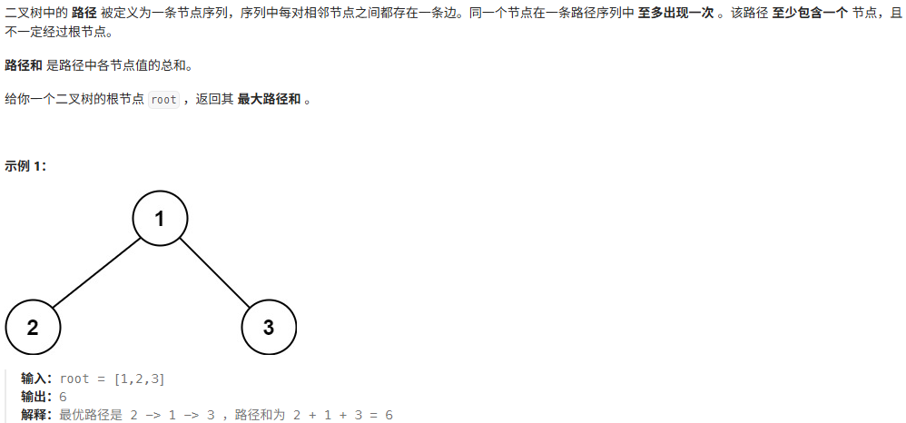

> todo

思路：

```java
class Solution {
    private int ans = Integer.MIN_VALUE;
    public int maxPathSum(TreeNode root) {
        dfs(root);
        return ans;
    }
    private int dfs(TreeNode node) {
        if (node == null) {
            return 0; // 没有节点，和为 0
        }
        int lVal = dfs(node.left); // 左子树最大链和
        int rVal = dfs(node.right); // 右子树最大链和
        ans = Math.max(ans, lVal + rVal + node.val); // 两条链拼成路径，全局最大值
        return Math.max(Math.max(lVal, rVal) + node.val, 0); // 当前子树最大链和，注意这里和0取最大值
    }
}
```

单层dfs的返回值是一条链的（左或者右），或者都是负数的话就返回0。这单链的值是给父节点用的，是单层递归的返回值

**`ans` 是"倒V字型"路径（可以分叉），`return值` 是"直线型"链条（不能分叉）**
