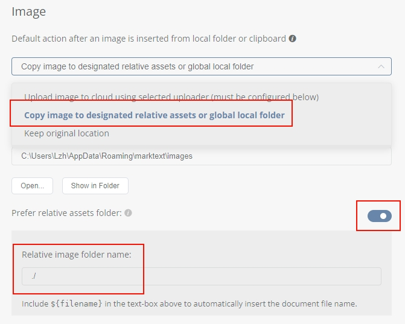

+++
date = '2026-01-11T19:30:59+08:00'
draft = true
title = '[持续更新...]维护Hugo中遇到的问题' 
+++

# 1 正文插入的图片无法正确显示

**问题描述**：在markdown文件中可以正确渲染的图片，但是在静态页面中无法正确渲染


**原因及解决方法**：

- 可能是图片保存路径错误，最好是图片与当前的markdown同级：

```
content/
└── post/
    └── my-first-post/      <-- 文件夹名为文章 slug
        ├── index.md        <-- 必须命名为 index.md
        └── cat.jpg         <-- 图片文件
```

- 图片后缀最好为(*.jpg)，亲测使用png后缀导致渲染失败，可以设置截图工具以及markdown编辑器的图片保存路径和后缀：
  
  - 截图工具以pixpin为例，设置手动保存和自动保存的后缀均为.jpg：
  
  
  
  - markdown编辑器以MarkText为例，设置图片保存路径为当前所在目录：


