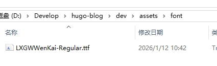

+++
date = '2026-01-11T21:44:13+08:00'
draft = true
title = '[Stack美化]一些样式修改'
+++

## 修改字体

（1）首先下载字体文件

（2）把字体放在 `assets/font`下，自己创建文件夹



（3）将以下代码修改并复制到`layouts/partials/footer/custom.html`文件中(文件不存在就自己创建)

- **字体名**：给字体命名一个别名，随便填写就好，保持统一就行
- **字体文件名**：字体文件的全名，带后缀名的，也就是 **xxx.ttf**

```
<style>
  @font-face {
    font-family: '字体名';
    src: url({{ (resources.Get "font/字体文件名").Permalink }}) format('truetype');
  }

  :root {
    --base-font-family: '字体名';
    --code-font-family: '字体名';
  }
</style>
```
