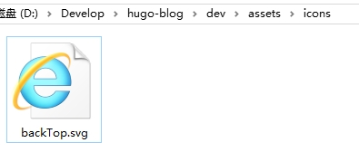
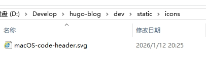
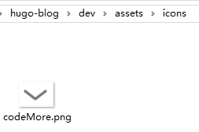
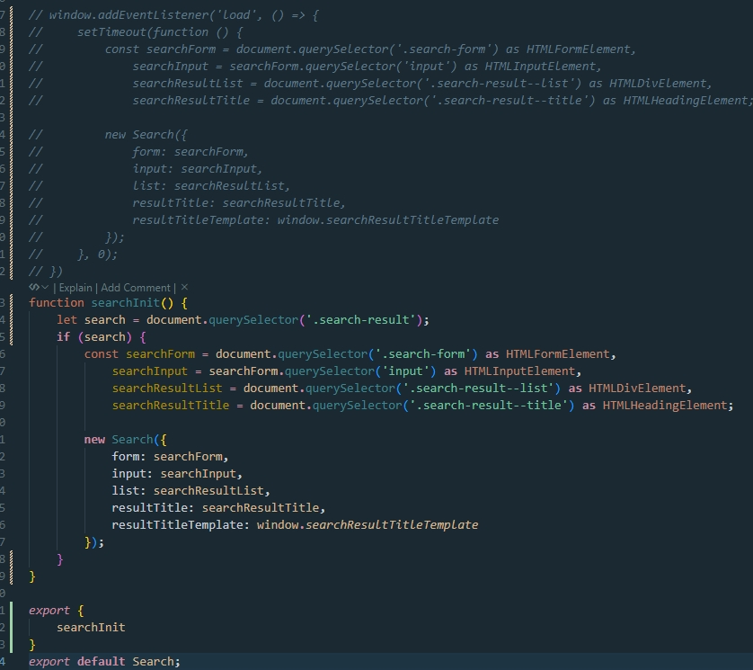
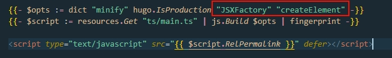
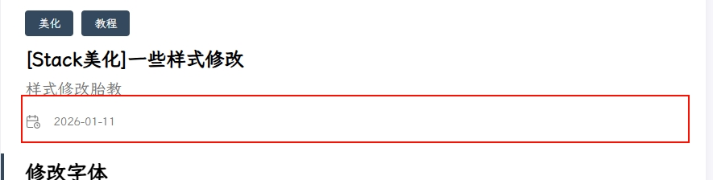

+++
date = '2026-01-11T21:44:13+08:00'
draft = true
title = '【Stack美化】一些样式修改'
description = '样式修改胎教'
categories = [
    '美化',
    '教程',
]
tags = [
    'html',
    'css',
    'markdown',
]
image = '1cc2da31-d479-4fb6-82a2-31dc69c2c7f0.jpg'
+++

## 修改字体

（1）首先下载字体文件

（2）把字体放在 `assets/font`下，自己创建文件夹


（3）将以下代码修改并复制到`layouts/partials/footer/custom.html`文件中(文件不存在就自己创建)

- **字体名**：给字体命名一个别名，随便填写就好，保持统一就行
- **字体文件名**：字体文件的全名，带后缀名的，也就是 **xxx.ttf**

```html
<style>
  @font-face {
    font-family: '字体名';
    src: url({{ (resources.Get "font/字体文件名").Permalink }}) format('truetype');
  }

  :root {
    --base-font-family: '字体名';
    --code-font-family: '字体名';
  }
</style>
```

## 添加最后更新时间

（1）在`hugo.yaml`中加入以下配置

```yaml
# 更新时间：优先读取git时间 -> git时间不存在，就读取本地文件修改时间
frontmatter:
  lastmod:
    - :git
    - :fileModTime

# 允许获取Git信息        
enableGitInfo: true
```

（2）修改github action文件 `.github/workflows/xxx.yaml`， 在运行 `hugo -D`命令的step前加入以下配置

```yaml
name: deploy

# 代码提交到main分支时触发github action
on:
  push:
    branches:
      - main

jobs:
  deploy:
    runs-on: ubuntu-latest
    steps:
        - name: Checkout
          uses: actions/checkout@v4
          with:
              fetch-depth: 0
        # 获取时间      
        - name: Git Configuration
          run: |
            git config --global core.quotePath false
            git config --global core.autocrlf false
            git config --global core.safecrlf true
            git config --global core.ignorecase false 

        - name: Setup Hugo
          uses: peaceiris/actions-hugo@v3
          with:
              hugo-version: "latest"
              extended: true

        - name: Build Web
          run: hugo -D

        - name: Deploy Web
          uses: peaceiris/actions-gh-pages@v4
          with:
              PERSONAL_TOKEN: ${{ secrets.TOKEN }}
              EXTERNAL_REPOSITORY: Inorysekiro2333/Inorysekiro2333.github.io
              PUBLISH_BRANCH: main
              PUBLISH_DIR: ./public
              commit_message: auto deploy
```

## 新增友情链接、归档双栏显示

修改`assets/scss/custom.scss` 文件（不存在则自行创建）， 引入以下css样式代码

```css
@media (min-width: 1024px) {
  .article-list--compact {
    display: grid;
    // 目前是两列，如需三列，则后面再加一个1fr，以此类推
    grid-template-columns: 1fr 1fr;
    background: none;
    box-shadow: none;
    gap: 1rem;

    article {
      background: var(--card-background);
      border: none;
      box-shadow: var(--shadow-l2);
      margin-bottom: 8px;
      margin-right: 8px;
      border-radius: 16px;
    }
  }
}
```

## 文章目录折叠&展开

将以下代码复制到`layouts/partials/footer/custom.html`文件中（不存在则自行创建）

```html
<style>
    #TableOfContents > ul, ol {
        ul, ol {
            display: none;
        }
        .open {
            display: block;
        }
    }
</style>

<script>
    function initTocHide() {
        // 判断是否存在文章目录
        let toc = document.querySelector(".widget--toc");
        if (!toc) {
            return;
        }
        // 监听滚动
        window.addEventListener('scroll', function() {
            //清除class值
            let openUl = document.querySelectorAll(".open");
            if (openUl.length > 0) {
              openUl.forEach((ul) => {
                ul.classList.remove("open")
              })
            }
            // 获取active-class
            let currentLi = document.querySelector(".active-class");
            if (!currentLi) {
                return
            }
            // 展示子ul
            if (currentLi.children.length > 1) {
                currentLi.children[1].classList.add("open")
            }
            // 展示父ul
            let ul = currentLi.parentElement;
            do {
                ul.classList.add("open");
                ul = ul.parentElement.parentElement
            } while (ul !== undefined && (ul.localName === 'ul' || ul.localName === 'ol'))
        });
    }
    initTocHide()
</script>
```

## 返回顶部按钮

（1）准备一张返回顶部图片，放到`assets/icons`文件夹下



（2）将以下代码复制到`layouts/partials/footer/custom.html` 文件中（不存在则自行创建）

```html
<style>
    #backTopBtn {
        display: none;
        position: fixed;
        bottom: 30px;
        z-index: 99;
        cursor: pointer;
        width: 30px;
        height: 30px;
        background-image: url({{ (resources.Get "icons/backTop.svg").Permalink }});
    }
</style>

<script>
    /**
     * 滚动回顶部初始化
     */
    function initScrollTop() {
        let rightSideBar = document.querySelector(".right-sidebar");
        if (!rightSideBar) {
            return;
        }
        // 添加返回顶部按钮到右侧边栏
        let btn = document.createElement("div");
        btn.id = "backTopBtn";
        btn.onclick = backToTop
        rightSideBar.appendChild(btn)
        // 滚动监听
        window.onscroll = function() {
            // 当网页向下滑动 20px 出现"返回顶部" 按钮
            if (document.body.scrollTop > 20 || document.documentElement.scrollTop > 20) {
                btn.style.display = "block";
            } else {
                btn.style.display = "none";
            }
        };
    }

    /**
     * 返回顶部
     */
    function backToTop(){
        window.scrollTo({ top: 0, behavior: "smooth" })
    }

    initScrollTop();
</script>
```

## macOS风格的代码块

（1）准备一张macOS风格的红绿灯图，放到`static/icons`目录下



（2）将以下代码复制到`assets/scss/custom.scss`文件中

```css
.highlight {
  border-radius: var(--card-border-radius);
  max-width: 100% !important;
  margin: 0 !important;
  box-shadow: var(--shadow-l1) !important;
}

.highlight:before {
  content: "";
  display: block;
  background: url(../icons/macOS-code-header.svg) no-repeat 0;
  background-size: contain;
  height: 18px;
  margin-top: -10px;
  margin-bottom: 10px;
}
```

## 代码块过长的展开&折叠

（1）准备一张向下的箭头图，保存到`assets/icons`目录下



（2）将以下代码复制到`layouts/partials/footer/custom.html` 文件中（不存在则自行创建）

```html
<style>
    .highlight {
        /* 你可以根据需要调整这个高度 */
        max-height: 400px;
        overflow: hidden;
    }

    .code-show {
        max-height: none !important;
    }

    .code-more-box {
        width: 100%;
        padding-top: 78px;
        background-image: -webkit-gradient(linear, left top, left bottom, from(rgba(255, 255, 255, 0)), to(#fff));
        position: absolute;
        left: 0;
        right: 0;
        bottom: 0;
        z-index: 1;
    }

    .code-more-btn {
        display: block;
        margin: auto;
        width: 44px;
        height: 22px;
        background: #f0f0f5;
        border-top-left-radius: 8px;
        border-top-right-radius: 8px;
        padding-top: 6px;
        cursor: pointer;
    }

    .code-more-img {
        cursor: pointer !important;
        display: block;
        margin: auto;
        width: 22px;
        height: 16px;
    }
</style>

<script>
  function initCodeMoreBox() {
    let codeBlocks = document.querySelectorAll(".highlight");
    if (!codeBlocks) {
      return;
    }
    codeBlocks.forEach(codeBlock => {
      // 校验是否overflow
      if (codeBlock.scrollHeight <= codeBlock.clientHeight) {
        return;
      }
      // 元素初始化
      // codeMoreBox
      let codeMoreBox = document.createElement('div');
      codeMoreBox.classList.add('code-more-box');
      // codeMoreBtn
      let codeMoreBtn = document.createElement('span');
      codeMoreBtn.classList.add('code-more-btn');
      codeMoreBtn.addEventListener('click', () => {
        codeBlock.classList.add('code-show');
        codeMoreBox.style.display = 'none';
        // 触发resize事件，重新计算目录位置
        window.dispatchEvent(new Event('resize'))
      })
      // img
      let img = document.createElement('img');
      img.classList.add('code-more-img');
      img.src = {{ (resources.Get "icons/codeMore.png").Permalink }}
      // 元素添加
      codeMoreBtn.appendChild(img);
      codeMoreBox.appendChild(codeMoreBtn);
      codeBlock.appendChild(codeMoreBox)
    })
  }

  initCodeMoreBox();
</script>
```

## 樱花动态特效

把樱花的动态特效js文件放到`assets/background`文件夹下，然后将以下代码复制到`layouts/partials/footer/custom.html` 文件中（不存在则自行创建）

```html
<script src={{ (resources.Get "background/sakura.js").Permalink }}></script>
```

## 无缝加载

### 引入PJAX

https://github.com/MoOx/pjax

根据文档，在`layouts/partials/footer/custom.html`中加入下面代码：

```html
<!-- 【custom.html】 -->
<script src="https://cdn.jsdelivr.net/npm/pjax/pjax.min.js"></script>
<script>
    var pjax = new Pjax({
        selectors: [
            ".main-container"
        ]
    })
</script>
```

### 问题修复

引入pjax以后会有以下问题：

1. 文章样式无法正常显示

2. 主题切换有问题

3. 文章搜索功能失效

4. 搜索内容跳转失效

5. KaTeX失效

下面一个个修复

#### 文章样式无法正常显示

`layouts/partials/footer/custom.html`中引入

```html
<script>
    pjax._handleResponse = pjax.handleResponse;
    pjax.handleResponse = function(responseText, request, href, options) {
        if (request.responseText.match("<html")) {
            if (responseText) {
                // 将新页面的html字符串解析成DOM对象
                let newDom = new DOMParser().parseFromString(responseText, 'text/html');
                // 获取新页面中body的className，并设置回当前页面
                let bodyClass = newDom.body.className;
                document.body.setAttribute("class", bodyClass)
            }
            // 放行，交给pjax自己处理
            pjax._handleResponse(responseText, request, href, options);
        } else {
            // handle non-HTML response here
        }
    }
</script>
```

#### 主题切换修复

同样在footer/custom.html中引入

```html
<script>
    document.addEventListener('pjax:complete', () => {
        // Stack脚本初始化
        window.Stack.init();
    })
</script>
```

#### 文章搜索和搜索功能跳转

（1）查看`themes\hugo-theme-stack\assets\ts\search.tsx` 注释掉`window.addEventListener()`函数，并在下面引入代码

```tsx
/**
 * 记得把window.addEventListener('load' ...这部分代码注释掉
 * 初始化工作交给Stack.init()处理了，不需要这个了
 */  
...
function searchInit() {
    let search = document.querySelector('.search-result');
    if (search) {
        const searchForm = document.querySelector('.search-form') as HTMLFormElement,
            searchInput = searchForm.querySelector('input') as HTMLInputElement,
            searchResultList = document.querySelector('.search-result--list') as HTMLDivElement,
            searchResultTitle = document.querySelector('.search-result--title') as HTMLHeadingElement;

        new Search({
            form: searchForm,
            input: searchInput,
            list: searchResultList,
            resultTitle: searchResultTitle,
            resultTitleTemplate: window.searchResultTitleTemplate
        });
    }
}

export {
    searchInit
}
```



（2）修改`assets/ts/search.tsx`代码，引入搜索初始化方法并调用

```ts
...
import { searchInit } from "ts/search";
let Stack = {
    init: () => {
        ...
        // 调用search脚本初始化方法
        searchInit();
    }
}
```

在`doSearch()`方法末尾重新解析文档

```tsx
private async doSearch(keywords: string[]) {
    ...
    /* 
    方法末尾，让pjax重新解析文档数据，识别动态渲染的数据
    虽然当前文件没有pjax对象，但最后静态页面会生成一个整体的js文件
    pjax对象那时就能识别到，就可成功调用
    */
    pjax.refresh(document);
}
```

（3）找到`layouts/partials/footer/components/script.html`补充下面内容

"JSXFactory" "createElement"



#### 数学公式KaTex修复

（1）在`layouts/partials/article/components/math.html`添加元素

```html
<div class="math-katex"></div>
```

（2）`layouts/partials/footer/custom.html`引入下面代码

```html
<script>
    async function renderKaTeX() {
        // 判断当前页面是否有KateX
        let katex = document.querySelector(".math-katex");
        if (!katex) {
            return;
        }
        // 等待函数加载成功后，再执行渲染方法
        while (typeof renderMathInElement !== 'function') {
            await delay(500);
        }        
        // KaTeX渲染方法
        renderMathInElement(document.body, {
            delimiters: [
                { left: "$$", right: "$$", display: true },
                { left: "$", right: "$", display: false },
                { left: "\\(", right: "\\)", display: false },
                { left: "\\[", right: "\\]", display: true }
            ],
            ignoredClasses: ["gist"]
        });
    }

    /**
     * 同步延迟
     */
    function delay(time) {
        return new Promise(resolve => {
            setTimeout(resolve, time)
        })
    }

    document.addEventListener('pjax:complete', () => {
        renderKaTeX();
    })
</script>
```

## 虚拟进度条

（1）前往[topbar by buunguyen](https://buunguyen.github.io/topbar/)

解压后的topbar.min.js放到`assets\js\topbar.min.js`

（2）`footer\custom.html`引入

```html
<!--custom.html-->

{{ with resources.Get "js/topbar.min.js" }}
    <!-- 引入本地JS脚本 -->
    <script src={{ .Permalink }}></script>
{{ end }}
<script>
    // 修改进度条颜色
    topbar.config({
        barColors: {
            '0': 'rgba(255,  255, 255, 1)', // 进度0%白色
            '1.0': 'rgba(0, 149, 234,  1)' // 进度100%蓝色
        }
    })

    document.addEventListener('pjax:send', () => {
        // 显示顶部进度条
        topbar.show();
    })

    document.addEventListener('pjax:complete', () => {

        // 隐藏顶部进度条
        topbar.hide();
    })
</script>
```

---

## todolist

1. 最底下的标签栏换掉✅

2. 文章的标题图片

3. 

这里加上时间，字数统计等信息

4. 完善一下归档、标签

5. 动态背景✅

6. 鼠标指针

7. 音乐播放

8. live2D看板娘

---

## 代码块美化

将代码块改为原生实现的 macOS 红绿灯风格，并添加悬停上浮效果。

### 修改文件：`assets/scss/custom.scss`

```scss
// 代码块原生样式 - 简约现代风格
.highlight {
  border-radius: var(--card-border-radius);
  max-width: 100% !important;
  margin: 0 !important;
  box-shadow: var(--shadow-l1) !important;
  position: relative;
  transition: transform 0.3s cubic-bezier(0.4, 0, 0.2, 1), box-shadow 0.3s cubic-bezier(0.4, 0, 0.2, 1);
  border: 1px solid var(--line-color);
  overflow: hidden;
}

.highlight:hover {
  transform: translateY(-6px);
  box-shadow: 0 12px 24px rgba(0, 0, 0, 0.12) !important;
}

// 红绿灯头部
.highlight-header {
  display: flex;
  align-items: center;
  gap: 8px;
  padding: 10px 14px;
  background: var(--code-background);
  border-bottom: 1px solid var(--line-color);
}

.highlight-dot {
  width: 12px;
  height: 12px;
  border-radius: 50%;
  transition: transform 0.2s ease;
}

.highlight-dot:nth-child(1) {
  background: #ff5f56;
}

.highlight-dot:nth-child(2) {
  background: #ffbd2e;
}

.highlight-dot:nth-child(3) {
  background: #27c93f;
}

// 悬停时红绿灯轻微放大
.highlight:hover .highlight-dot {
  transform: scale(1.1);
}
```

### 修改文件：`layouts/partials/footer/custom.html`

添加红绿灯头部初始化脚本：

```html
<!-- 代码块红绿灯头部 -->
<script>
    function initCodeHeader() {
        const codeBlocks = document.querySelectorAll('.highlight');
        codeBlocks.forEach(block => {
            if (block.querySelector('.highlight-header')) {
                return;
            }
            const header = document.createElement('div');
            header.className = 'highlight-header';
            const colors = ['#ff5f56', '#ffbd2e', '#27c93f'];
            colors.forEach(color => {
                const dot = document.createElement('span');
                dot.className = 'highlight-dot';
                dot.style.background = color;
                header.appendChild(dot);
            });
            block.insertBefore(header, block.firstChild);
        });
    }
    initCodeHeader();
</script>
```

并在 `pjax:complete` 中添加 `initCodeHeader()` 调用。

---

---

## 返回顶部按钮

右下角显示返回顶部按钮，滚动超过300px后显示。

### 修改文件：`layouts/partials/footer/custom.html`

```html
<!-- 返回顶部按钮样式 -->
<style>
    #backTopBtn {
        display: none;
        position: fixed;
        right: 24px;
        bottom: 24px;
        z-index: 100;
        cursor: pointer;
        width: 44px;
        height: 44px;
        background: var(--card-background);
        border: 1px solid var(--line-color);
        border-radius: 12px;
        box-shadow: var(--shadow-l1);
        transition: all 0.3s ease;
        display: flex;
        align-items: center;
        justify-content: center;
    }

    #backTopBtn:hover {
        background: var(--accent-color);
        border-color: var(--accent-color);
        transform: translateY(-2px);
        box-shadow: var(--shadow-l2);
    }

    #backTopBtn svg {
        width: 20px;
        height: 20px;
        color: var(--card-text-color);
        transition: color 0.3s ease;
    }

    #backTopBtn:hover svg {
        color: #fff;
    }
</style>

<!-- 返回顶部 -->
<script>
    function initScrollTop() {
        if (document.getElementById('backTopBtn')) {
            document.getElementById('backTopBtn').remove();
        }
        let btn = document.createElement("div");
        btn.id = "backTopBtn";
        btn.innerHTML = `<svg xmlns="http://www.w3.org/2000/svg" fill="none" viewBox="0 0 24 24" stroke="currentColor">
            <path stroke-linecap="round" stroke-linejoin="round" stroke-width="2" d="M5 15l7-7 7 7" />
        </svg>`;
        btn.onclick = backToTop;
        document.body.appendChild(btn);

        window.addEventListener('scroll', function() {
            if (document.body.scrollTop > 300 || document.documentElement.scrollTop > 300) {
                btn.style.display = 'flex';
            } else {
                btn.style.display = 'none';
            }
        });
    }

    function backToTop() {
        window.scrollTo({ top: 0, behavior: 'smooth' });
    }

    initScrollTop();
</script>
```

---

## 特色图片悬浮效果

文章特色图片悬停时有轻微放大效果。

### 修改文件：`layouts/partials/article/components/header.html`

```html
<!-- 特色图片悬浮效果 -->
<style>
    .article-image-wrapper {
        margin: -24px -24px 24px -24px;
        overflow: hidden;
        border-radius: var(--card-border-radius) var(--card-border-radius) 0 0;
    }

    .article-image {
        position: relative;
        overflow: hidden;
    }

    .featured-image {
        width: 100%;
        height: auto;
        max-height: 400px;
        object-fit: cover;
        transition: transform 0.5s cubic-bezier(0.4, 0, 0.2, 1);
    }

    .article-image:hover .featured-image {
        transform: scale(1.03);
    }
</style>
```

---

## 字数统计

在文章底部显示字数统计。

### 修改文件：`layouts/partials/article/components/footer.html`

```html
<!-- 字数统计 -->
<section class="article-wordcount">
    <svg xmlns="http://www.w3.org/2000/svg" fill="none" viewBox="0 0 24 24" stroke="currentColor">
        <path stroke-linecap="round" stroke-linejoin="round" stroke-width="2" d="M9 12h6m-6 4h6m2 5H7a2 2 0 01-2-2V5a2 2 0 012-2h5.586a1 1 0 01.707.293l5.414 5.414a1 1 0 01.293.707V19a2 2 0 01-2 2z" />
    </svg>
    <span>{{ T "article.wordCount" .WordCount }}</span>
</section>

<!-- 文章底部居中样式 -->
<style>
    .article-footer {
        display: flex;
        flex-direction: column;
        align-items: center;
        gap: 16px;
        padding-top: 24px;
        margin-top: 32px;
        border-top: 1px solid var(--line-color);
    }

    .article-wordcount {
        display: flex;
        align-items: center;
        gap: 8px;
        color: var(--card-text-secondary);
        font-size: 13px;
        order: 0;
    }

    .article-wordcount svg {
        width: 16px;
        height: 16px;
    }
</style>
```

### 添加翻译：`themes/hugo-theme-stack/i18n/zh-cn.yaml`

```yaml
wordCount:
    other: "字数: {{ .Count }}"
```

---

## 封面图片展示效果优化


